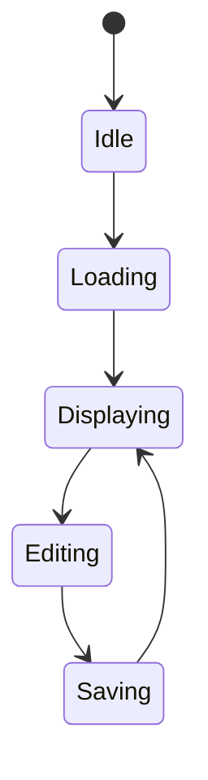

# AGENTS.Policy.md

General policy for creating and managing IEC 62304 certification document sets for medical device software. This policy is product-independent and can be applied to any software product requiring IEC 62304 Class A/B/C compliance.

## 1. Document Set Structure

### 1.1 Required Documents (IEC 62304)

Every software product must produce the following controlled document set:

| Document Type | IEC 62304 Clause | Content Focus |
| --- | --- | --- |
| Software Validation Report | 5.8 | Validation basis, lifecycle evidence, release conclusion |
| Software Development Planning | 5.1 | Lifecycle phases, roles, deliverables, configuration management, maintenance |
| Software High Level Design | 5.3 | Architecture, decomposition, safety classification, interfaces, SOUP |
| Software Verification Plan | 5.5, 5.6 | Verification strategy, levels, acceptance criteria, environment, schedule |
| Software Verification Report | 5.7 | Executed procedures, configuration under test, results, deviations, conclusion |
| Requirement Specification (RS) | 5.2 | System-level requirements with acceptance criteria |
| Software Requirement Specification (SwSRS) | 5.2 | Software-level requirements with acceptance criteria and design allocation |
| Software Design Specification (SwSDS) | 5.4 | Detailed design per unit with I/O, algorithms, flowcharts, interfaces |
| Traceability Matrix | 5.7, 7.3 | RS -> SRS -> SDS -> procedures -> results chain |
| Unit Test Procedures (SwSTP) | 5.5 | Per-requirement test setup, steps, acceptance criteria |
| Unit Test Results (SwSTR) | 5.5 | Mirror of SwSTP with execution status per procedure |
| Integration Test Procedures (SwTP) | 5.5 | Cross-module workflow verification |
| Integration Test Results (SwTR) | 5.5 | Mirror of SwTP with execution status |
| System Test Procedures (SystemTP) | 5.6 | Product-level end-to-end verification |
| System Test Results (SystemTR) | 5.6 | Mirror of SystemTP with execution status |

### 1.2 Risk And Cybersecurity Documents

| Document Type | Standard | Content Focus |
| --- | --- | --- |
| FMEA | ISO 14971, IEC 62304 7.1 | Hazard identification, severity/occurrence scoring, risk controls, verification |
| Cybersecurity Requirements | MDCG 2019-16, AAMI TIR 57 | Cybersecurity essentials checklist, risk evaluation, maintenance plan |
| Network Security Enclosure | IEC 62304 5.6, 7.1 | Security verification test cases and results |

## 2. Document Identifier Policy

### 2.1 Naming Convention

Use a short product-prefixed identifier family: `{PRODUCT}-{TYPE}-{SEQ}`

Example for product "PV" (Portview):

```
PV-SV-01    Software Validation Report
PV-RS-01    Requirement Specification
PV-SRS-01   Software Requirement Specification
PV-SDS-01   Software Design Specification
PV-TM-01    Traceability Matrix
PV-STP-01   Unit Test Procedures
PV-STR-01   Unit Test Results
PV-TP-01    Integration Test Procedures
PV-TR-01    Integration Test Results
PV-SYSTP-01 System Test Procedures
PV-SYSTR-01 System Test Results
PV-CSRS-01  Cybersecurity Requirements
```

### 2.2 File Naming

Files follow the pattern: `({ID}) {Title}.md`

```
(PV-SV-01) Software Validation Report.md
(PV-RS-01) RS.md
(FMEA-Z01) Risks FMEA.md
```

### 2.3 Internal Identifiers

| Level | Prefix | Example |
| --- | --- | --- |
| System requirements | `RS-xxx` | RS-001, RS-025 |
| Software requirements | `SRS-xxx` | SRS-001, SRS-037 |
| Design items | `SDS-xxx` | SDS-001, SDS-031 |
| Unit procedures | `UTP-xxx` | UTP-001, UTP-025 |
| Integration procedures | `ITP-xxx` | ITP-001, ITP-036 |
| System procedures | `SYSP-xxx` | SYSP-001, SYSP-009 |
| FMEA items | `FMEA-xxx` | FMEA-001, FMEA-021 |

Do not use legacy identifiers from source systems (e.g., Polarion CA-xxxx) as primary IDs.

## 3. Document Lifecycle

### 3.1 Status Transitions

```
Draft -> Released
```

- `Draft`: Active authoring. Scaffolding sections (Document Overview, Open Items) may be present.
- `Released`: All scaffolding removed. Document Approval signatures completed. Ready for regulatory submission.

### 3.2 Release Checklist

Before changing status from Draft to Released:

- [ ] Document Overview section removed
- [ ] Open Items section removed or resolved
- [ ] Document Approval signatures completed (Prepared / Reviewed / Approved)
- [ ] All cross-references use controlled document IDs
- [ ] No legacy identifiers in the document body
- [ ] No migration provenance wording in the document body
- [ ] Acceptance criteria present for all requirements
- [ ] Design allocation column present in SwSRS
- [ ] Flowcharts present for all design items in SwSDS
- [ ] Independent reviewer recorded in all result documents
- [ ] Evidence references point to QMS controlled archive

## 4. Traceability Requirements

### 4.1 Full Traceability Chain

Every requirement must be traceable through this chain:

```
RS -> SRS -> SDS -> UTP/ITP -> STR/TR -> SYSP -> SYSTR
```

### 4.2 Traceability Matrix Structure

Split into functional groups. Each group uses two tables:

- **Risk Assessment**: ID, Title, Harm, S, O(pre), RP(pre)
- **Risk Control**: ID, Risk Control, O(post), RP(post), Acceptable, Verification

For wide tables (7+ columns), split into related tables linked by ID.

### 4.3 Coverage Gaps

When a requirement is intentionally verified at only one level (e.g., integration only), document the design decision with justification in the traceability matrix coverage notes.

## 5. Design Specification Requirements

### 5.1 Per-Unit Content

Each design item (SDS-xxx) must include:

- Input/Output table
- Algorithm description (flowchart or pseudo-code)
- Mermaid flowchart diagram
- Error handling paths (failure branches in flowchart)
- Sub-process descriptions where applicable

### 5.2 Inter-Unit Interfaces

Document explicitly in a dedicated section:

| Source Unit | Target Unit | Transferred Data | Trigger | Failure Handling |
| --- | --- | --- | --- | --- |

### 5.3 State Models

Document state transitions for complex units (e.g., viewer):



### 5.4 Design Verification

Reference the verification plan (SV-04) and unit procedures (SwSTP) in a dedicated section.

## 6. Risk Management Requirements

### 6.1 FMEA Structure

Split wide FMEA tables into:

- **Risk Identification**: ID, Title, Harm, Risk Control (4 columns)
- **Risk Scoring**: ID, S, O(pre), RP(pre), O(post), RP(post), Acceptable, Verification (8 columns, short values)

### 6.2 Scoring Method

| Factor | Scale |
| --- | --- |
| Severity (S) | Product-specific scale (e.g., 1-5) |
| Occurrence (O) | Product-specific scale (e.g., 1-5) |
| Risk Priority (RP) | S x O |

Define acceptability thresholds. Document pre-control and post-control scores to demonstrate risk reduction.

### 6.3 Cybersecurity Integration

Cross-reference cybersecurity controls to FMEA items in a dedicated section. Map each cybersecurity checklist item to:

- FMEA ID
- Risk category (Identify/Protect/Detect/Respond/Recover)
- Control integration description

### 6.4 External References

All verification evidence must reference controlled documents. If external documents (user manuals, supplier reports) are referenced, either:

- (A) Include them in the controlled document set
- (B) Remove and replace with equivalent controlled verification references

## 7. Verification And Result Documents

### 7.1 Procedure-Result Pairing

Each procedure document has a paired result document:

- Procedure: setup, execution intent, acceptance criteria
- Result: mirrors procedure rows with executor, date, status, deviation

### 7.2 Independent Verification

- Record an independent reviewer (different from executor) in execution information
- Add an execution note justifying single-executor throughput if applicable

### 7.3 Evidence References

Every result document must include an Evidence References section:

| Evidence Type | Reference | Location |
| --- | --- | --- |
| Executed test protocol | Signed protocol for procedures | QMS controlled archive |
| Test environment log | Platform configuration and session log | QMS controlled archive |
| Independent review record | Review sign-off | QMS controlled archive |

## 8. Tooling

### 8.1 Authoring

- Markdown as source of truth
- MkDocs Material for local preview
- Git for version control

### 8.2 PDF Export

- Playwright-based export script for Mermaid-compatible PDF generation
- `@page { margin: 10mm }` for reduced margins
- Batch rendering for documents with many diagrams
- CSS-based table page-break handling

### 8.3 Tool Validation

Document development tools and their validation approach in the Software Development Planning document:

| Tool | Validation Approach |
| --- | --- |
| Compiler/IDE | Industry-adopted OTS; validated through build output |
| Source control | Validated through established use |
| Test platform | Validated through controlled hardware configuration |

## 9. New Product Onboarding

To create a certification document set for a new product:

1. **Define product prefix**: e.g., `NP` for "New Product"
2. **Copy document templates**: Create all 18 document files with `(NP-{TYPE}-{SEQ}) Title.md` naming
3. **Populate requirements**: Start with RS (system) -> SRS (software) with acceptance criteria
4. **Create design specification**: Architecture, per-unit design with flowcharts, inter-unit interfaces
5. **Define procedures**: Unit (UTP), integration (ITP), system (SYSP) with setup and acceptance criteria
6. **Build traceability matrix**: RS -> SRS -> SDS -> UTP/ITP -> SYSP full chain
7. **Perform FMEA**: Risk identification, scoring, controls, verification mapping
8. **Execute and record results**: STR, TR, SYSTR paired with procedures
9. **Complete SV core documents**: SV-01 through SV-05 referencing the full document set
10. **Release**: Remove scaffolding, complete signatures, transition to Released status

## 10. Compliance Verification Checklist

Before regulatory submission, verify:

| IEC 62304 Clause | Check | Document |
| --- | --- | --- |
| 5.1 | Lifecycle planning complete with tool validation and maintenance process | SV-02 |
| 5.2 | All requirements have acceptance criteria and design allocation | RS, SwSRS |
| 5.3 | Architecture decomposed with safety classification per unit | SV-03 |
| 5.4 | Per-unit design with I/O, algorithms, flowcharts, error handling, interfaces | SwSDS |
| 5.5 | Unit and integration procedures with paired results | SwSTP/STR, SwTP/TR |
| 5.6 | System procedures formally adopted with paired results | SystemTP/TR |
| 5.7 | Full traceability chain, approval signatures completed | TM, SV-05 |
| 5.8 | Validation report with release conclusion | SV-01 |
| 7.1 | FMEA with pre/post risk scores, cybersecurity integration | FMEA, CSRS |
| 7.3 | All documents Released status, configuration controlled | All |
