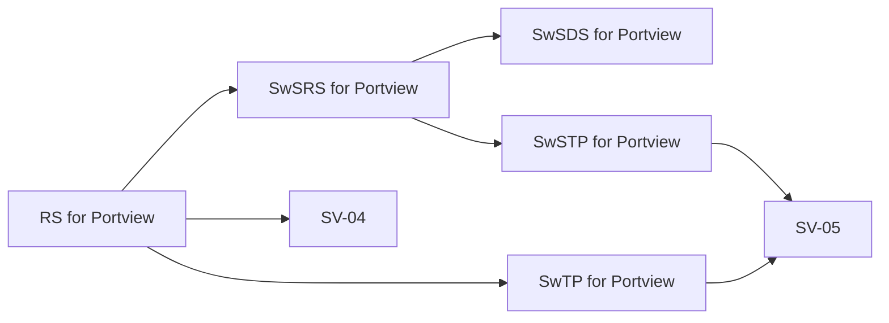

# (PV-RS-01) RS

Document ID: `PV-RS-01`  
Product: `Portview`  
Document Status: `Released`

## Document Overview

This document defines the system-level requirement set for Portview.

Document notes:

- The current draft is focused on the Portview viewer and supporting workflow functions.
- ImageProcess-specific requirement content is intentionally excluded from this document set.

## Document Approval

### Prepared by

| Title | Name | Signature |
| --- | --- | --- |
| Manager | `S. R. Lim` |  |
| Staff | `J. B. Kim` |  |
| Deputy General Manager | `N. Y. Choi` |  |
| Manager | `H. J. Cho` |  |

### Reviewed by

| Title | Name | Signature |
| --- | --- | --- |
| General Manager | `S. I. Choi` |  |
| Manager | `M. C. Boo` |  |
| Deputy General Manager | `C. H. Lee` |  |
| Deputy General Manager | `H. S. Park` |  |

### Approved by

| Title | Name | Signature |
| --- | --- | --- |
| CTO (Director) | `K. Y. Ro` |  |

## Revision History

| Rev. | Date | Description |
| --- | --- | --- |
| `0.0` | `2023-12-11` | Initial version created after requirement subdivision |
| `0.1` | `2025-07-24` | Added additional requirement specifications including translation support |

## 1. Purpose

This document defines the system-level requirements for the Portview dental image viewer.

The requirement set is intended to:

- define the intended user-visible capabilities of the workstation software
- identify the main operating constraints and support functions
- provide the system-level input used by downstream software requirements, design, and verification documents

## 2. Scope

This document applies to the Portview software environment running on a Windows-based workstation.

In scope:

- image acquisition from supported sources
- patient and account handling
- image viewing, comparison, annotation, and measurement
- export, print, and DICOM communication
- device status, logging, and multilingual user interface behavior

Out of scope:

- ImageProcess-specific image-quality processing requirements

## 3. Requirement Summary

The system-level requirements currently fall into the following functional groups.

| Functional Group | Coverage |
| --- | --- |
| Operating context | Windows account execution, workstation behavior, status messaging |
| Image acquisition | Intraoral sensor image capture, digital image capture, TWAIN import |
| Viewer functions | Main viewer, compare viewer, tooth map, pan, rotate, zoom |
| Output and communication | Print, export to file or media, DICOM transmission |
| Device interaction | Sensor selection, connection status, device status, FMX continuous acquisition |
| Data integrity and robustness | USB integrity confirmation, network support, activity logging, stability guidance |
| Administrative functions | Account management, annotation and measurement, multilingual GUI, error messaging |

## 4. Requirement Catalogue

### 4.1 Operating Environment And Access

| Requirement ID | Requirement | Acceptance Criteria |
| --- | --- | --- |
| `RS-001` | Portview runs under a Windows OS account | Application launches and operates under a standard Windows user account without requiring administrative privileges for normal workflow |
| `RS-002` | Portview uses pop-up windows to present message or status information | Status and error messages are displayed as user-visible pop-up windows; messages remain visible until user acknowledgment |

### 4.2 Acquisition And Device Interaction

| Requirement ID | Requirement | Acceptance Criteria |
| --- | --- | --- |
| `RS-003` | Acquire intraoral sensor image | Sensor image is acquired and displayed under the selected patient context without data corruption |
| `RS-004` | Acquire digital images | Digital image file is imported and associated with the active patient record |
| `RS-005` | Acquire image from TWAIN device | TWAIN image is acquired and displayed correctly in the viewer |
| `RS-006` | Provide FMX continuous acquisition | Sequential acquisition proceeds through all positions in the selected FMX layout |
| `RS-007` | Select one sensor from multiple available sensors | Selected sensor becomes active; subsequent acquisition uses the chosen device |
| `RS-008` | Display sensor connection status | Connection status changes between connected and disconnected states are reflected in the UI within the current workflow cycle |
| `RS-009` | Show device status | Current device state is displayed accurately for connected modalities |

### 4.3 Viewing And Diagnostic Interaction

| Requirement ID | Requirement | Acceptance Criteria |
| --- | --- | --- |
| `RS-010` | Main viewer displays images on the mounted layout | Selected patient images are rendered on the correct mount layout without misattribution |
| `RS-011` | Provide tooth map window | Tooth map navigation selects and displays the correct image for the chosen position |
| `RS-012` | Provide image comparison | At least two images can be compared side-by-side with independent viewing state |
| `RS-013` | Allow image move, rotate, or zoom | Pan, rotate, and zoom operations update the display without losing image context or annotation state |
| `RS-014` | Provide annotation and measurement functions | Annotation and measurement tools create, display, and persist overlays correctly across viewer sessions |

### 4.4 Output And Communication

| Requirement ID | Requirement | Acceptance Criteria |
| --- | --- | --- |
| `RS-015` | Provide printing | Selected image is printed through the standard print path without application error |
| `RS-016` | Export images to file | Image export file is created at the target location with preserved attribution |
| `RS-017` | Export images to media device | Export to CD or equivalent media completes successfully or reports a user-visible error |
| `RS-018` | Send image to DICOM server | DICOM transmission completes successfully or failure is detected and reported to the user |

### 4.5 Integrity, Robustness, And User Guidance

| Requirement ID | Requirement | Acceptance Criteria |
| --- | --- | --- |
| `RS-019` | Confirm USB integrity before delivery or installation use | Integrity check detects corruption on delivered USB media and reports the result |
| `RS-020` | Support network connection needed to receive image from the device | Network-based acquisition path remains functional when the local network connection is available |
| `RS-021` | Record program activity in a log | Auditable operations are recorded in the activity log with sufficient detail for troubleshooting |
| `RS-022` | Provide system-instability guidance | Error type is classified and troubleshooting instructions are presented to the user |
| `RS-023` | Classify and display malfunction-related error messages | Malfunction-related errors produce a user-visible classified error message |

### 4.6 Administrative And Localization Support

| Requirement ID | Requirement | Acceptance Criteria |
| --- | --- | --- |
| `RS-024` | Manage account | Patient records can be created, modified, searched, and deleted with data consistency preserved |
| `RS-025` | Support multilingual GUI behavior | GUI text changes to the selected language without layout corruption or content loss |

## 5. Interface Expectations

The system-level requirement set assumes the following external or user-facing interfaces:

- supported sensor or device interfaces used for image acquisition
- file-based and TWAIN-based import paths
- DICOM server or printer communication paths
- removable media or file-export destinations
- local workstation user-account and storage environment

## 6. Requirement Relationships

The system-level requirement set feeds the software requirement and verification set as shown below.

## 7. Verification Use

This requirement document is intended to feed:

- `SwSRS for Portview`
- `SwTP for Portview`
- `SV-04` Software Verification Plan
- `SV-05` Software Verification Report
- the Portview traceability matrix
