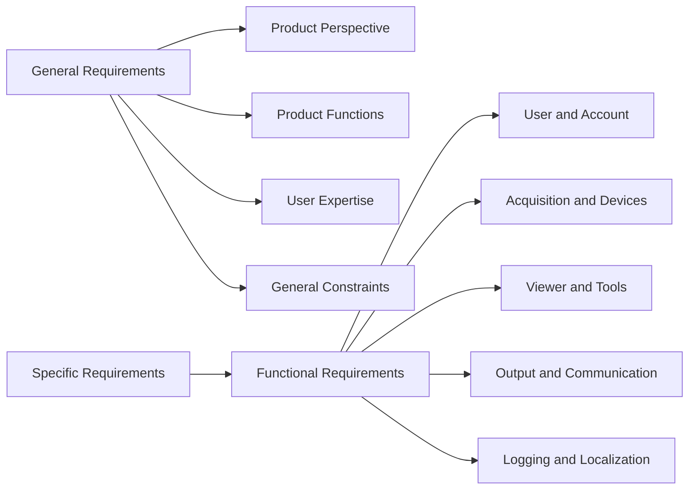

# (PV-SRS-01) SwSRS

Document ID: `PV-SRS-01`  
Product: `Portview`  
Document Status: `Released`

## Document Overview

This document defines the software requirements for Portview.

Document notes:

- The current structure follows the functional scope visible in the existing Portview software requirement set.
- Portview-only content is retained in this document set.

## Document Approval

### Prepared by

| Title | Name | Signature |
| --- | --- | --- |
| Manager | `J. W. Lee` |  |

### Reviewed by

| Title | Name | Signature |
| --- | --- | --- |
| General Manager | `S. I. Choi` |  |

### Approved by

| Title | Name | Signature |
| --- | --- | --- |
| CTO (Director) | `K. Y. Ro` |  |

## Revision History

| Rev. | Date | Description |
| --- | --- | --- |
| `0.0` | `2012.03.07` | Initial version |
| `0.1` | `2015.01.12` | User interface update |
| `0.2` | `2016.01.19` | New function implemented |
| `0.3` | `2017.01.13` | System issue revision |
| `0.4` | `2018.01.12` | New device added |
| `0.5` | `2019.01.21` | Device compatibility update |
| `0.6` | `2020.01.30` | Device compatibility update |
| `0.7` | `2020.10.08` | GUI update |
| `0.8` | `2021.02.26` | Linkage usability improvement |
| `0.9` | `2021.09.10` | Program issue update |
| `1.0` | `2021.10.08` | Device compatibility update |
| `1.1` | `2022.03.04` | Connection-status improvement |
| `1.2` | `2023.01.04` | Increased image capacity |
| `1.3` | `2023.04.21` | Device compatibility update |
| `1.4` | `2024.01.08` | Device compatibility update |
| `1.5` | `2024.01.10` | Document number changed from 603 to Z01 according to OP-709 |
| `1.6` | `2025.07.24` | Updated general requirements and added GUI translation requirement |

## 1. Purpose

This document defines the software requirements for Portview and describes the software behavior needed to satisfy the intended product workflow.

## 2. References

The software requirement set is supported primarily by:

- `RS for Portview`
- `SwSDS for Portview`
- `SV-04` Software Verification Plan
- `SV-05` Software Verification Report

## 3. Definitions And Acronyms

Common terminology should be normalized in the controlled release set. Acronyms visible in the current requirement content include:

| Acronym | Meaning |
| --- | --- |
| `DICOM` | Digital Imaging and Communications in Medicine |
| `GUI` | Graphical User Interface |
| `TWAIN` | Imaging-device interface standard used for import |

## 4. General Requirements

### 4.1 Product Perspective

Portview is workstation software used to acquire, store, display, review, and exchange dental images.

The current software context includes:

- patient management functionality
- device-service connectivity checks
- image-viewer presentation and annotation tools
- export and communication services
- GUI translation support

The authored scope excludes ImageProcess-specific processing requirements.

### 4.2 Product Functions

The software supports:

- patient-oriented image acquisition and review
- image storage and retrieval
- diagnostic viewing and comparison
- annotation and measurement
- print, export, and DICOM communication
- device connectivity status and operational logging

### 4.3 Intended User Context

The software operator is expected to understand clinical or hospital workflow and to be familiar with the applicable user manual.

### 4.4 General Constraints

The software relies on:

- supported workstation operating system configuration
- supported acquisition devices and drivers
- controlled local storage and communication interfaces

The currently visible constraints are:

| Constraint Area | Current Controlled Statement |
| --- | --- |
| Operating system | Windows XP Service Pack 2 (x86) or higher |
| Concurrent database users | Depends on the operating system configuration |
| Display resolution | Greater than `1024 x 768` |
| Database-server memory | Greater than `4 GB` |

## 5. Functional Requirement Groups

### 5.1 User And Account Functions

| SRS ID | Requirement | Design Allocation | Acceptance Criteria |
| --- | --- | --- | --- |
| `SRS-001` | User authentication using Windows account | `SDS-001` | Application authenticates user through the Windows OS account; no separate login is required |
| `SRS-002` | Patient registration | `SDS-001` | New patient record is created with validated demographic fields and persisted to the database |
| `SRS-003` | Modify patient information | `SDS-001` | Modified patient fields are saved correctly; invalid modifications produce an error message |
| `SRS-004` | Search patient | `SDS-001` | Search by patient identifiers returns matching records; no-match condition is handled gracefully |
| `SRS-005` | Delete patient | `SDS-001` | Patient record is removed after confirmation; active-record conflicts are prevented |

### 5.2 Acquisition Functions

| SRS ID | Requirement | Design Allocation | Acceptance Criteria |
| --- | --- | --- | --- |
| `SRS-006` | Acquire image from IO sensor | `SDS-024` | Sensor image is acquired and displayed under the selected patient without data corruption |
| `SRS-007` | Select the device that captures the image | `SDS-023`, `SDS-028` | Selected device becomes active and viewer state follows the selected device type |
| `SRS-008` | Display status of the device | `SDS-026` | Device status changes are reflected correctly between connected and disconnected states |
| `SRS-009` | Acquire image from a file | `SDS-002` | Selected file is imported and displayed correctly; unsupported format produces an error |
| `SRS-010` | Acquire image from TWAIN device | `SDS-025` | TWAIN image is acquired and displayed correctly in the viewer |

### 5.3 Viewer Functions

| SRS ID | Requirement | Design Allocation | Acceptance Criteria |
| --- | --- | --- | --- |
| `SRS-011` | Display image of a patient on mounted device | `SDS-003` | Main viewer displays the selected patient mount or current image set without misattribution |
| `SRS-012` | Display images using thumbnail | `SDS-004` | Thumbnail viewer shows available images and selection state correctly |
| `SRS-013` | Window to select tooth positions to capture | `SDS-005` | Tooth map navigates to the correct image for the selected position |
| `SRS-014` | Compare selected images | `SDS-006` | Comparison view is presented for the selected images with independent viewing state |
| `SRS-015` | Move image | `SDS-003` | Image position changes according to pan interaction without losing annotations |
| `SRS-016` | Zoom image | `SDS-013` | Image zoom level changes in and out as commanded; image remains usable |
| `SRS-017` | Rotate image | `SDS-014` | Image rotates or flips according to selected option without corrupting display |

### 5.4 Annotation And Measurement

| SRS ID | Requirement | Design Allocation | Acceptance Criteria |
| --- | --- | --- | --- |
| `SRS-018` | Ellipse | `SDS-007` | Ellipse annotation is created, displayed, and retained correctly across viewer sessions |
| `SRS-019` | Text | `SDS-008` | Text annotation is created, displayed, and retained correctly |
| `SRS-020` | Arrow | `SDS-009` | Arrow annotation is created, displayed, and retained correctly |
| `SRS-021` | Pencil | `SDS-010` | Pencil annotation is created, displayed, and retained correctly |
| `SRS-022` | Angle | `SDS-011` | Angle measurement is created and displayed correctly |
| `SRS-023` | Length | `SDS-012` | Length measurement is created, calibrated, and displayed correctly |

### 5.5 Output And Exchange

| SRS ID | Requirement | Design Allocation | Acceptance Criteria |
| --- | --- | --- | --- |
| `SRS-024` | Print the selected image | `SDS-015` | Selected image is printed through the standard print path without application error |
| `SRS-025` | Print the selected image using a DICOM printer | `SDS-016` | Image is transmitted to DICOM printer without application error |
| `SRS-026` | Export patient image information to file | `SDS-017` | Image export file is created successfully at target location with preserved attribution |
| `SRS-027` | Export images to media device such as CD or DVD | `SDS-018` | Export to media completes successfully or reports user-visible error |
| `SRS-028` | Send image to DICOM server through network | `SDS-019` | DICOM transmission completes or failure is detected and reported |
| `SRS-029` | Import patients from disc | `SDS-001` | Imported patient data is loaded into the local store with validated records |

### 5.6 Device And Workflow Support

| SRS ID | Requirement | Design Allocation | Acceptance Criteria |
| --- | --- | --- | --- |
| `SRS-030` | Switch FMX continuous acquisition | `SDS-027` | Continuous-acquisition workflow proceeds according to the selected FMX mode |
| `SRS-031` | Use multiple sensor | `SDS-028` | Selected sensor becomes active and acquisition path follows the chosen device |
| `SRS-032` | Display wait status | `SDS-029` | Sensor or device wait status is shown consistently for the current connection state |
| `SRS-033` | USB data integrity check | `SDS-030` | Integrity-check result is available and unexpected corruption is detected |
| `SRS-034` | Local network connection to the medical device | `SDS-020` | Network-based connectivity required for device workflow is available and stable |

### 5.7 Logging, Robustness, And Localization

| SRS ID | Requirement | Design Allocation | Acceptance Criteria |
| --- | --- | --- | --- |
| `SRS-035` | Record activity status | `SDS-021` | Activity log records expected operations without corruption |
| `SRS-036` | System instability guidelines | `SDS-031` | Error type is classified and troubleshooting guidance is displayed |
| `SRS-037` | Multilingual support | `SDS-022` | GUI text changes to the selected language without layout or content corruption |

## 6. Requirement Structure

The current software requirement set follows the pattern below.

## 7. Requirement Coverage Map

The currently visible requirement identifiers can be grouped as follows.

| Requirement Group | Representative IDs |
| --- | --- |
| User and account handling | `SRS-001`, `SRS-002`, `SRS-003`, `SRS-004`, `SRS-005` |
| Acquisition and import | `SRS-006`, `SRS-007`, `SRS-008`, `SRS-009`, `SRS-010` |
| Viewer and display | `SRS-011`, `SRS-012`, `SRS-013`, `SRS-014`, `SRS-015`, `SRS-016`, `SRS-017` |
| Output and communication | `SRS-024`, `SRS-025`, `SRS-026`, `SRS-027`, `SRS-028`, `SRS-029` |
| Device support and workflow | `SRS-030`, `SRS-031`, `SRS-032`, `SRS-033`, `SRS-034` |
| Logging and localization | `SRS-035`, `SRS-036`, `SRS-037` |

## 8. Downstream Use

This software requirement set is intended to drive:

- detailed design allocation in `SwSDS for Portview`
- procedure selection in `SwSTP for Portview` and `SwTP for Portview`
- traceability coverage in the Portview traceability matrix
- verification planning and reporting in `SV-04` and `SV-05`
