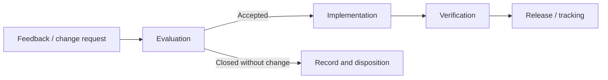

# (PV-SV-02) Software Development Planning

Document ID: `PV-SV-02`  
Product: `Portview`  
Document Status: `Released`

## Document Approval

### Prepared by

| Title | Name | Signature |
| --- | --- | --- |
| General Manager | `S. I. Choi` |  |
| Manager | `M. C. Boo` |  |

### Reviewed by

| Title | Name | Signature |
| --- | --- | --- |
| Deputy General Manager | `Y. Jeon` |  |

### Approved by

| Title | Name | Signature |
| --- | --- | --- |
| CTO (Director) | `K. Y. Ro` |  |

## Revision History

| Rev. | Date | Description |
| --- | --- | --- |
| `0.0` | `2018-10-08` | Firstly prepared |
| `0.1` | `2023-05-10` | Updated according to IEC 62304:2015 |
| `0.2` | `2023-12-18` | Document number changed from 603 to Z01 according to OP-709 |
| `0.3` | `2025-08-14` | Added software maintenance and problem-resolution process in section 10 |

## 1. Purpose

This document describes the overall software development process used for Portview and defines the planning controls applied to development, verification, configuration management, and maintenance activities.

The plan is intended to:

- define the software lifecycle and its managed phases
- identify development roles, responsibilities, and controlled deliverables
- define verification, risk-management, and maintenance planning expectations
- define configuration-control and naming conventions for the Portview document set

## 2. Scope

This plan applies to the Portview software lifecycle, from development planning and implementation through verification, release, maintenance, and problem resolution.

In scope:

- lifecycle planning for Portview software activities
- controlled deliverables and document naming conventions
- software verification and validation planning
- software risk-management planning
- software configuration management and change control
- maintenance and post-release problem-resolution process

## 3. Referenced Documents

The following references govern this planning document.

| Reference | Use |
| --- | --- |
| Medical Device Regulation (EU) 2017/745 | Regulatory framework |
| Quality management systems - Requirements | Quality-system reference |
| EN ISO 13485:2016 Medical devices Quality management systems | Governing quality management standard |
| EN 60601-1:2006/A1:2013 Medical electrical equipment | Basic safety and essential performance reference |
| ISO 12052:2006 DICOM including workflow and data management | Governing interoperability standard |
| IEC 62304:2006/AMD1:2015 Software lifecycle processes | Governing software lifecycle standard |
| Guidance for the Content of Premarket Submissions for Software Contained in Medical Devices | Regulatory guidance |
| General Principles of Software Validation Final Guidance for Industry and FDA Staff | Regulatory guidance |
| Software and Medical Devices (VdTUV, 2001) | External guidance reference |
| QM Quality System Documentation | Internal quality reference |
| QM Design Control Procedure | Internal process reference |
| QM Software Development Procedure | Internal process reference |
| QM Corrective and Preventive Actions | Internal process reference |
| QM Document Control | Internal process reference |

## 4. Roles And Responsibilities

The software development process is managed through defined organizational roles.

| Activity Area | Responsible Position | Primary Responsibility |
| --- | --- |
| Project management | CTO (Director) of R&D Center; Deputy General Manager of R&D Center | Approves lifecycle direction, deliverables, and release readiness |
| Hazard analysis | Deputy General Manager of R&D Center | Maintains risk-analysis coordination and risk-control review |
| Verification and validation testing | Staff of R&D Center; Manager of R&D Center; Deputy General Manager of R&D Center | Plans, executes, reviews, and closes software verification activities |
| Documentation review | Deputy General Manager of R&D Center | Reviews controlled technical documents and revision updates |
| Software team | Manager and engineers of R&D Center | Implements software changes, maintains source control, and prepares technical deliverables |

## 5. Software Lifecycle Overview

Portview follows a managed lifecycle comprising definition, design, implementation, qualification, release, and maintenance activities.

| Lifecycle Phase | Planning Intent |
| --- | --- |
| Definition | Establish scope, intended use, requirements, and risk inputs |
| Design | Define software architecture, interfaces, and controlled design outputs |
| Implementation | Build and maintain the controlled software configuration |
| Qualification | Perform unit, integration, and system verification activities |
| Release | Confirm completion of required lifecycle outputs and approved release content |
| Maintenance | Control released changes, bug fixes, upgrades, and post-release feedback |

### 5.1 Lifecycle Governance

The lifecycle is governed through controlled inputs, documented outputs, and review gates at the end of each major phase.

| Governance Topic | Planning Statement |
| --- | --- |
| Entry to a phase | Approved inputs, assigned owners, and available controlled templates are required |
| Exit from a phase | Required deliverables, review findings, and open actions are recorded before closure |
| Change during a phase | Changes are managed through the approved configuration-management and change-control process |
| Release readiness | Release requires completed verification evidence, dispositioned anomalies, and approved records |

## 6. Development Processes And Deliverables

The Portview software process uses controlled phases, end-of-phase reviews, technical documentation, and lifecycle deliverables.

| Topic | Planning Statement |
| --- | --- |
| Lifecycle process | Activities and tasks are conducted under a controlled software lifecycle |
| End-of-phase review | Each major phase is expected to close with review of deliverables and open actions |
| Technical documentation | Controlled documents are maintained for requirements, design, verification, traceability, and release evidence |
| Traceability | Relationships between system requirements, software requirements, tests, and risk controls are maintained through the document set |

### 6.1 Controlled Portview Document Set

| Document Type | Controlled Identifier Pattern |
| --- | --- |
| Software Validation Report | `PV-SV-01` |
| Software Development Planning | `PV-SV-02` |
| Software High Level Design | `PV-SV-03` |
| Software Verification Plan | `PV-SV-04` |
| Software Verification Report | `PV-SV-05` |
| Traceability Matrix | `PV-TM-01` |
| Requirement Specification | `PV-RS-01` |
| Software Requirement Specification | `PV-SRS-01` |
| Software Design Specification | `PV-SDS-01` |
| Software Unit Test Procedure / Result | `PV-STP-01`, `PV-STR-01` |
| Software Integration Test Procedure / Result | `PV-TP-01`, `PV-TR-01` |
| System Test Procedure / Result | `PV-SYSTP-01`, `PV-SYSTR-01` |

### 6.2 Planned Deliverables By Lifecycle Stage

| Lifecycle Stage | Primary Deliverables |
| --- | --- |
| Definition | Requirement inputs, risk inputs, planning records |
| Design | High-level design, software design specifications, architecture traceability |
| Implementation | Controlled source code, build outputs, code-review records |
| Qualification | Unit, integration, and system procedures and results |
| Release | Validation report, release record, approved anomaly disposition |
| Maintenance | Change requests, change instructions, maintenance verification records |

## 7. Verification And Validation Planning

Verification and validation activities are planned by level and tied to controlled procedure sets.

| Verification Level | Planning Statement |
| --- | --- |
| Unit test | Software units are verified against detailed requirement inputs and acceptance criteria |
| Integration test | Integrated software behavior is evaluated across software-unit interfaces |
| System test | Software system behavior is evaluated against system-level requirements before release |

### 7.1 Verification Planning Principles

The Portview verification plan is expected to ensure that:

- each verification level is tied to controlled inputs and expected outputs
- acceptance criteria are established before execution
- regression testing is applied when software changes affect released behavior
- verification status is recorded through controlled execution and result records

### 7.2 Acceptance Criteria

The acceptance criteria for Portview software verification are intended to ensure that requirements:

- implement system-level requirements including those related to risk mitigations
- do not contradict one another
- are expressed in terms that avoid ambiguity
- permit establishment of test acceptance criteria and objective evaluation
- are uniquely identified
- are traceable to design outputs and verification evidence

### 7.3 Development Tool Validation

Development-support tools used in the Portview software lifecycle are validated or qualified as follows:

| Tool | Version | Purpose | Validation Approach |
| --- | --- | --- | --- |
| Microsoft Visual C++ | 2017 Professional Edition | C++ compilation and build | Generally recognized OTS development tool; validated through industry adoption and build-output verification |
| Git server | Controlled configuration | Source control and change management | Validated through established use in the controlled development environment |
| Genoray testing platform | Default configuration | Test execution environment | Validated through controlled hardware configuration and documented test setup |

Tool validation records are maintained in the QMS controlled archive. If a development-support tool is upgraded or replaced, the tool-validation assessment is repeated before the tool is used in controlled verification activities.

## 8. Risk Management Planning

Software safety requirements are flowed down from the system risk-management files. Portview units are assessed through risk analysis and FMEA, and risk-control measures are verified through the controlled verification and validation activities.

| Risk Topic | Planning Statement |
| --- | --- |
| Risk input | Flowed down from system risk-management files |
| Analysis method | Function/module-based risk review and FMEA |
| Mitigation verification | Verified through controlled V&V activities |
| Residual risk handling | Evaluated through the controlled risk-management process |

## 9. Documentation And Naming Conventions

Every controlled document should maintain a defined identifier and revision convention.

| Rule | Description |
| --- | --- |
| Prefix | Controlled document type identifier |
| Suffix | `Rev <n>.<n>` or the applicable controlled revision format |
| Naming pattern | Portview document names should follow the controlled product and document-code convention |

### 9.1 Documentation Control Expectations

| Topic | Expectation |
| --- | --- |
| Revision control | Each controlled document retains an approved revision history |
| Naming consistency | Product naming, document identifiers, and revision references remain consistent across the document set |
| Distribution | Controlled documents are released through the approved document-control process |
| Traceability references | Cross-references should use controlled identifiers rather than informal names where possible |

## 10. Configuration Management And Change Control

Portview source and related software subsystems are controlled through a software configuration-management system and change-control process.

| Configuration Topic | Planning Statement |
| --- | --- |
| Source control | Portview source is controlled through a Git server with change control |
| Configuration items | Software documents, builds, procedures, results, and supporting artifacts are placed under control |
| Change management | Changes are processed through the approved design and software change procedures |
| Build integrity | Engineering management is responsible for ensuring implementation integrity within the controlled configuration baseline |

### 10.1 Controlled Configuration Items

| Configuration Item | Purpose |
| --- | --- |
| Validation report | Validation effectiveness evidence |
| Development planning | Lifecycle planning and task definition |
| High-level design | Architecture and item decomposition |
| Verification plan | Unit, integration, and system test planning |
| Verification report | Released verification outcomes |
| Requirement and design specifications | Controlled technical inputs and outputs |
| Test procedures and results | Released verification records |

### 10.2 Configuration-Control Expectations

| Topic | Expectation |
| --- | --- |
| Baseline identification | Each released build and related document set is associated with a controlled baseline |
| Change approval | Software changes require review and approval before release |
| Status accounting | Configuration status is maintained for source, documents, procedures, and released outputs |
| Archiving | Released software and supporting records are retained in the approved archive structure |

## 11. Software Maintenance And Problem Resolution

Post-release feedback and software change handling are managed through a controlled maintenance and problem-resolution process.

| Topic | Process Summary |
| --- | --- |
| Feedback intake | Service and sales teams receive requests and prepare change records |
| Evaluation | R&D/Product Management evaluates whether a request is a problem to resolve |
| Resolution | Maintainers implement approved changes and report completion through change instructions |
| Tracking | Requests and resulting instructions are tracked under change control |
| Post-release risk management | Risk-management activities are applied to released-software changes when applicable |
| SOUP maintenance | Upgrades, bug fixes, patches, and obsolescence handling are managed through the controlled process |

### 11.1 Maintenance Decision Flow

The post-release process is expected to distinguish between feedback that requires correction, feedback that results in an approved change request, and feedback that is closed without software modification.

### 11.2 Security Patch And SOUP Obsolescence Management

| Topic | Criteria |
| --- | --- |
| Patch classification | Security patches are classified as Critical (immediate deployment), High (deployment within 30 days), or Normal (next scheduled release) |
| Critical patch trigger | Confirmed exploitable vulnerability in Portview or its SOUP components affecting patient data integrity, system availability, or regulatory compliance |
| Deployment process | Critical and High patches follow the standard change-control process with expedited verification; Normal patches are bundled into scheduled releases |
| SOUP obsolescence handling | SOUP components are monitored for end-of-life and security advisories; obsolete components are replaced or isolated before the next scheduled release |
| Notification | Affected vendors and users are notified of Critical patches via the help desk team; patch deployment instructions are provided with each notification |
| Verification | Security patches are verified through the applicable unit, integration, or system verification procedures before deployment; regression testing is applied when the patch affects released behavior |
