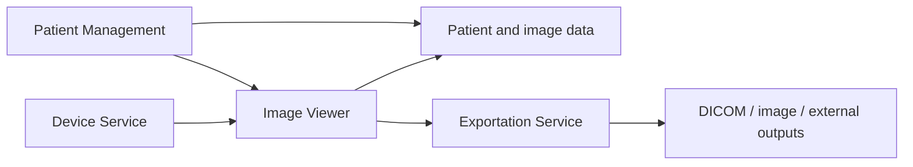
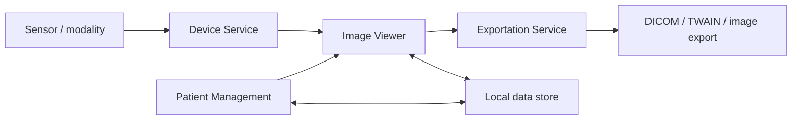

# (PV-SV-03) Software High Level Design

Document ID: `PV-SV-03`  
Product: `Portview`  
Document Status: `Released`

## Document Approval

### Prepared by

| Title | Name | Signature |
| --- | --- | --- |
| Manager | `J. W. Lee` |  |
| Staff | `J. B. Kim` |  |
| General Manager | `S. I. Choi` |  |

### Reviewed by

| Title | Name | Signature |
| --- | --- | --- |
| Manager | `M. C. Boo` |  |

### Approved by

| Title | Name | Signature |
| --- | --- | --- |
| CTO (Director) | `K. Y. Ro` |  |

## Revision History

| Rev. | Date | Description |
| --- | --- | --- |
| `0.0` | `2012.07.02` | Initial Version |
| `0.1` | `2015.01.12` | User Interface Update |
| `0.2` | `2016.01.19` | New Function Implemented |
| `0.3` | `2017.01.13` | System Issue |
| `0.4` | `2018.01.12` | New Device Added |
| `0.5` | `2019.01.21` | Device Compatibility |
| `0.6` | `2020.01.30` | Device Compatibility |
| `0.7` | `2020.10.08` | GUI update |
| `0.8` | `2021.02.26` | Linkage usability improve |
| `0.9` | `2021.09.10` | Program Issue |
| `1.0` | `2021.10.08` | Device Compatibility |
| `1.1` | `2022.03.04` | Connection status improve |
| `1.2` | `2023.01.04` | Increasing image capacity |
| `1.3` | `2023.04.21` | Device Compatibility |
| `1.4` | `2024.01.08` | Device Compatibility |
| `1.5` | `2024.01.16` | Document number changed from 603 to Z01 according to OP-709 |
| `1.6` | `2025.08.14` | Added description and revised architecture content |

## 1. Purpose

This document presents the decomposition of Portview into software items and units and explains how design inputs are mapped into the high-level software structure and interfaces.

The document is intended to:

- define the high-level Portview software structure
- describe software-unit safety classification and interface relationships
- document platform, SOUP, and OTS assumptions
- provide architecture-level traceability to requirements and design documents

## 2. Scope

This high-level design covers the Portview PC application, including its principal software units, platform requirements, external interfaces, and architecture-level design constraints.

In scope:

- Portview software decomposition and software-unit descriptions
- software safety classification context
- requirement/document traceability at architecture level
- hardware platform and operating-system assumptions
- Portview architecture, interfaces, security, and data-integrity principles

## 3. Referenced Documents

The following references support the high-level design.

| Reference | Use |
| --- | --- |
| `PV-SV-01` Software Validation Report | Validation basis and release conclusion |
| `PV-SV-02` Software Development Planning | Lifecycle and configuration-management context |
| `PV-SV-04` Software Verification Plan | Verification planning and procedure references |
| `PV-SV-05` Software Verification Report | Verification execution results |
| `PV-RS-01` RS for Portview | System-level requirement input |
| `PV-CSRS-01` [SwRS for Cybersecurity]((PV-CSRS-01) SwRS for Cybersecurity.md) | Cybersecurity design input |
| `PV-SRS-01` SwSRS for Portview | Software requirement input |
| `PV-SDS-01` SwSDS for Portview | Lower-level design reference |
| `PV-TM-01` Traceability Matrix | Requirement and design traceability reference |

## 4. Safety Classification Framework

The software safety classification scheme follows IEC 62304, with severity levels mapped to software safety classes.

| Severity Of Harm Class | Meaning | IEC 62304 Software Safety Class |
| --- | --- | --- |
| `1` | No injury or damage to health is possible | `A` |
| `2` | Non-serious injury is possible | `B` |
| `3`, `4`, `5` | Death or serious injury is possible | `C` |

Within the current Portview scope, the documented unit classifications indicate Class `A` and Class `B` items. Class `B` applies where delayed diagnosis or other non-serious injury scenarios remain possible.

## 5. Portview Software Decomposition

Portview is the parent software item in the current document scope. The high-level unit structure is organized so that patient workflow, device communication, image display, and export functions remain separated into distinct units with defined responsibilities.

The decomposition follows these principles:

- each software unit inherits its safety-classification context from the parent structure unless a lower classification is justified by reduced severity of harm
- device communication is mediated through a dedicated service layer rather than direct UI-to-device coupling
- patient data and image data are handled as controlled information objects that must remain attributable and recoverable
- export behavior is separated from viewing and acquisition logic so that downstream file-format handling remains isolated from image display workflows

| Parent Software Item | Portview Unit |
| --- | --- |
| Portview | Patient Management |
| Portview | Device Service |
| Portview | Image Viewer |
| Portview | Exportation Service |

## 6. Software Item Details And Risk Links

The Portview software units and their classification and risk context are summarized below. Risk references are aligned to the normalized `FR-xxx` identifiers defined in `PV-FMEA-01`.

| Unit Title | Class | Risk ID / Severity | Description |
| --- | --- | --- | --- |
| Patient Management | `A` | `FR-014 / 1`, `FR-015 / 1`, `FR-016 / 1`, `FR-017 / 1` | Patient registration, search, load, and reopen behavior is limited to no-injury workflow failures in the current scope |
| Device Service | `A`, `B` | `FR-012 / 1`, `FR-018 / 2` | Device detection, driver support, and acquisition availability include both no-harm and non-serious-injury contexts |
| Image Viewer | `A` | `FR-001 / 1`, `FR-002 / 1`, `FR-004 / 1`, `FR-013 / 1` | Viewer availability, audit support, and annotation-display behavior remain in the no-injury class in the current scope |
| Exportation Service | `A`, `B` | `FR-006 / 2`, `FR-008 / 1`, `FR-009 / 1`, `FR-010 / 1`, `FR-011 / 1` | Output, exchange, and external communication functions include confidentiality and interoperability risks |

## 7. Traceability To Requirements And Design

The high-level design maintains architecture-level traceability from Portview units to controlled requirement and design documents.

| Unit | Primary Requirement Reference | Primary Design Reference |
| --- | --- | --- |
| Portview software units | `PV-SRS-01` SwSRS for Portview | `PV-SDS-01` SwSDS for Portview |
| System-level architecture context | `PV-RS-01` RS for Portview | This high-level design document |
| Cybersecurity-related design input | SwRS for Cybersecurity | Security-related architecture sections |

## 8. Platform And Common Architecture

### 8.1 Hardware Platform And Operating System

| Part | Specification |
| --- | --- |
| OS | Windows 10 or higher (32-bit or 64-bit) |
| CPU | Core Duo / Core2 Processor |
| RAM | 4 GB or higher |
| Storage | 100 GB free space or more |
| Ethernet | 100/1000 Mbps Ethernet |
| VGA | Onboard chipset or higher |
| ODD | DVD Multi |
| Monitor | 1280 x 1024 resolution or higher |
| Keyboard | 103/106 key |
| Mouse | Optical mouse |

### 8.2 Interface Relationships

Portview is designed around controlled data exchange between units rather than direct shared-function coupling. The principal interface relationships are summarized below.

| Interface | Description |
| --- | --- |
| Device Service -> Image Viewer | Acquired image data is transferred to the display workflow after modality communication is completed |
| Patient Management -> Image Viewer | The selected patient context determines which image set is loaded and displayed |
| Patient Management -> Data Store | Patient demographic and registration data is stored and retrieved through the local data structure |
| Image Viewer -> Data Store | Displayed images and related metadata are retrieved from and committed to the controlled data set |
| Image Viewer -> Exportation Service | The requested export action is handed off to the export workflow after user selection |
| Exportation Service -> External data formats | Images are converted and written to DICOM files, TWAIN data, image files, or database-related outputs |

### 8.3 Architecture View

The architecture is centered on a workstation application in which the user-facing image workflow, device communication, persistence layer, and export functions are separated but coordinated.

## 9. SOUP And OTS Assessment

### 9.1 Development Environment SOUP

| Item | Value |
| --- | --- |
| Program language | `C++` |
| OTS software | `Microsoft Visual C++` |
| Version | `2017 Professional Edition` |

The coding environment is treated as a generally used OTS development tool and is governed through the applicable quality procedures.

### 9.2 Operating System OTS

| Item | Value |
| --- | --- |
| OTS software | `Windows` |
| Manufacturer | `Microsoft` |
| Version basis | `Windows 10` with platform support defined as Windows 10 or higher |

The operating system supports memory allocation, storage-device management, and input/output handling for the workstation platform. The risk associated with this OTS software is treated as minor in the current design context because the worst credible harm is inconvenience or diagnostic delay.

## 10. Portview Architecture Controls

### 10.1 UI

The Portview user interface is intended to support a multi-language environment and to present acquisition, patient-management, image-viewing, and export workflows in a single operator-facing application.

UI expectations include:

- multiple-language support
- direct access to patient selection and image review workflows
- consistent presentation of acquisition, display, annotation, and export actions

### 10.2 Security

External network access is limited to the minimum interfaces required for intended operation:

- DICOM data services for transmitting and receiving images
- transmitting and receiving control commands between the device and the workstation

Security-oriented design expectations include:

- limiting external connectivity to approved operational interfaces
- preventing uncontrolled modification of the workstation software environment
- preserving the integrity of patient and image data during transfer and storage

### 10.3 Data Integrity

The basic data set consists of images and patient information. These data are treated as significant assets that must not be mixed, corrupted, misattributed, or lost.

Data-integrity design principles include:

- patient data and image data remain associated through controlled identifiers
- stored data must remain recoverable after routine workflow operations
- export functions must preserve data attribution and output consistency
- architecture decisions should avoid unintended overwrite or cross-patient data mixing

| Data Field | Description |
| --- | --- |
| ID | Chart ID |
| Name | Patient name |
| Sex | Patient sex |
| Birth | Patient birthdate |
| SSN | Patient social security number |
| Phone | Patient phone number |
| Email | Patient email |
