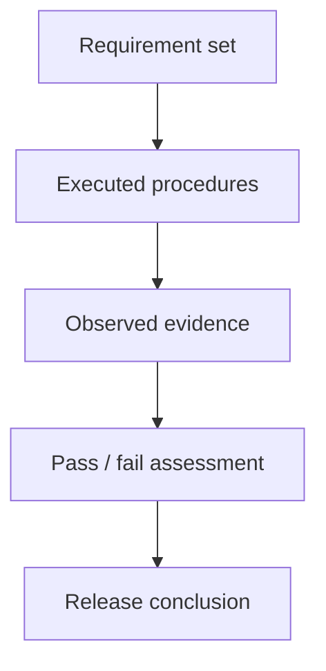

# (PV-SV-05) Software Verification Report

Document ID: `PV-SV-05`  
Product: `Portview`  
Document Status: `Released`

## Document Approval

### Prepared by

| Title | Name | Signature |
| --- | --- | --- |
| Manager | `S. R. Lim` |  |
| Staff | `J. B. Kim` |  |
| General Manager | `S. I. Choi` |  |

### Reviewed by

| Title | Name | Signature |
| --- | --- | --- |
| Manager | `M. C. Boo` |  |

### Approved by

| Title | Name | Signature |
| --- | --- | --- |
| CTO (Director) | `K. Y. Ro` |  |

## Revision History

| Rev. | Date | Description |
| --- | --- | --- |
| `0.0` | `2012.03.07` | Initial Version |
| `0.1` | `2015.01.12` | User Interface Update |
| `0.2` | `2016.01.19` | New Function Implemented |
| `0.3` | `2017.01.13` | System Issue |
| `0.4` | `2018.01.12` | New Device Added |
| `0.5` | `2019.01.21` | Device Compatibility |
| `0.6` | `2020.01.30` | Device Compatibility |
| `0.7` | `2020.10.08` | GUI update |
| `0.8` | `2021.02.26` | Linkage usability improve |
| `0.9` | `2021.09.10` | Program Issue |
| `1.0` | `2021.10.08` | Device Compatibility |
| `1.1` | `2022.03.04` | Connection status improve |
| `1.2` | `2023.01.04` | Increasing image capacity |
| `1.3` | `2023.04.21` | Device Compatibility |
| `1.4` | `2024.01.08` | Device Compatibility |
| `1.5` | `2024.02.20` | Document number changed from 603 to Z01 according to OP-709 |
| `1.6` | `2025.08.14` | Revision numbers of related documents updated |

## 1. Purpose

This report summarizes the executed verification activities for Portview and records whether the resulting evidence satisfies the acceptance logic defined by the verification plan.

The report is intended to:

- summarize executed verification work by level
- identify the configuration and procedure set used during verification
- record overall verification status and unresolved issues
- support a release or approval decision with explicit conclusion wording

## 2. Scope

This report covers the Portview verification activities linked to the software verification plan.

In scope:

- executed Portview unit verification evidence
- executed Portview integration verification evidence
- executed Portview system-level verification evidence
- final summary statements used to support verification closure

This report is organized around the released verification evidence summarized in the current report body. Software version `2.2.5.16` is associated with the `2024-10-02` release update for Windows 11 and GenX-CR compatibility.

## 3. Referenced Documents

This report should reference the governing plan and the principal controlled evidence sources.

| Reference | Use |
| --- | --- |
| `PV-SV-01` [Software Validation Report]((PV-SV-01) Software Validation Report.md) | Validation basis and release conclusion |
| `PV-SV-02` [Software Development Planning]((PV-SV-02) Software Development Planning.md) | Lifecycle and configuration-management context |
| `PV-SV-03` [Software High Level Design]((PV-SV-03) Software High Level Design.md) | Architecture and decomposition reference |
| `PV-SV-04` [Software Verification Plan]((PV-SV-04) Software Verification Plan.md) | Governing plan |
| `PV-RS-01` [RS for Portview]((PV-RS-01) RS.md) | Integration verification input |
| `PV-SRS-01` [SwSRS for Portview]((PV-SRS-01) SwSRS.md) | Unit verification input |
| `PV-SDS-01` [SwSDS for Portview]((PV-SDS-01) SwSDS.md) | Software design reference |
| `PV-STP-01` [SwSTP for Portview]((PV-STP-01) SwSTP.md) | Unit verification procedure |
| `PV-STR-01` [SwSTR-Z01 for Portview]((PV-STR-01) SwSTR.md) | Unit verification record |
| `PV-TP-01` [SwTP for Portview]((PV-TP-01) SwTP.md) | Integration verification procedure |
| `PV-TM-01` [Traceability Matrix]((PV-TM-01) Traceability Matrix.md) | Requirement and design traceability reference |
| `PV-TR-01` [SwTR-Z01 for Portview]((PV-TR-01) SwTR.md) | Integration verification record |
| `PV-SYSTR-01` [SystemTR-Z01]((PV-SYSTR-01) SystemTR.md) | System verification result record |

## 4. Verification Summary

The planned verification procedures were executed and the acceptance criteria were met by pass or justified disposition.

| Area | Planned | Executed | Status | Notes |
| --- | --- | --- | --- | --- |
| Unit | Portview unit verification procedures | Executed | `Pass summary stated` | Unit execution is identified as `PV-STR-01` |
| Integration | Portview integration verification procedures | Executed | `Pass summary stated` | Integration execution is identified as `PV-TR-01` |
| System | Portview system-level verification procedures | Executed | `Pass summary stated` | System execution is summarized in `PV-SYSTR-01` |

## 5. Configuration Under Test

This section defines the baseline represented by the report using the identifiers available in the current report body and related procedure records.

### 5.1 Software Baseline

| Item | Version / Identifier | Notes |
| --- | --- | --- |
| Product | `Portview` | Controlled product name |
| Verification plan reference | `PV-SV-04` version 1.6 with in-body reference to Rev 1.5 | Version identifiers should be aligned across the final document set |
| Software requirement baseline | `PV-SRS-01` SwSRS for Portview Rev 1.6 | Unit verification source |
| Integration requirement baseline | `PV-RS-01` RS for Portview Rev 0.1 | Integration verification source |
| Observed software version in procedure records | `Portview 2.2.5.16` | Release dated `2024-10-02`; Windows 11 and GenX-CR compatibility update |

### 5.2 Environment

| Environment Item | Version / Identifier | Notes |
| --- | --- | --- |
| Unit verification environment | `Genoray testing platform / Default configuration` | Recorded in `PV-STP-01` SwSTP for Portview |
| Integration verification environment | `Genoray testing platform / Default configuration` | Recorded in `PV-TP-01` SwTP for Portview |
| System verification environment | `Controlled by PV-SYSTR-01` | Separate environment details are not present in the currently available record set |

## 6. Executed Procedures

The procedure set below is limited to Portview-related entries.

| Procedure ID | Title | Date | Executor | Result |
| --- | --- | --- | --- | --- |
| `PV-STP-01` | [SwSTP for Portview]((PV-STP-01) SwSTP.md) | `2025.07.24` | `J.W. Lee` | `Procedure baseline` |
| `PV-STR-01` | [SwSTR-Z01 for Portview]((PV-STR-01) SwSTR.md) | `2025.07.24` | `J.W. Lee` | `Pass summary claimed` |
| `PV-TR-01` | [SwTR-Z01 for Portview]((PV-TR-01) SwTR.md) | `2025.07.24` | `J.W. Lee` | `Pass summary claimed` |
| `PV-SYSTR-01` | [SystemTR-Z01]((PV-SYSTR-01) SystemTR.md) | `2026.03.18` | `J.W. Lee` | `Passed` |

## 7. Results

This report currently provides summary statements rather than detailed defect records. The remaining evidence-linking work is identified below.

### 7.1 Unit Verification Results

Unit-level verification was properly accomplished.

Portview-specific summary:

- Portview unit verification was reported as completed against the Portview software requirement set
- the governing unit procedure is `PV-STP-01` [SwSTP for Portview]((PV-STP-01) SwSTP.md) and the unit result record is `PV-STR-01` [SwSTR-Z01 for Portview]((PV-STR-01) SwSTR.md)
- no Portview-specific open unit issue is stated in the summary section

### 7.2 Integration Verification Results

Integration tests were completed successfully and software verification was properly accomplished at the integration level.

Portview-specific summary:

- integration verification was reported against `PV-RS-01` RS for Portview software requirements
- the report references communication-function-related evaluation during integration testing
- the controlling integration procedure is `PV-TP-01` [SwTP for Portview]((PV-TP-01) SwTP.md) and the result record is `PV-TR-01` [SwTR-Z01 for Portview]((PV-TR-01) SwTR.md)

### 7.3 System Verification Results

System testing was conducted with `PV-SYSTR-01` [SystemTR-Z01]((PV-SYSTR-01) SystemTR.md), and system-level functions properly support the system specification.

Portview-specific summary:

- system-level testing is reported as completed
- the summary conclusion states that the supporting functions are proper at system level
- separate system execution metadata are not listed in the currently available controlled records

## 8. Deviations, Anomalies, And Open Issues

No open system problem report is identified, and deviations are effectively treated as `N/A` at the summary level. This document should nevertheless retain a formal issue table.

| ID | Description | Impact | Disposition | Owner |
| --- | --- | --- | --- | --- |
| `NONE-RECORDED` | No Portview-specific deviation is listed in the summary section | `None stated in summary` | `Review underlying records` | `Verification lead` |

## 9. Traceability Summary

Traceability should connect Portview requirements, Portview procedures, execution records, and final summary claims.

Traceability rules:

- each summary claim should link to a procedure identifier
- each procedure identifier should link to the executed evidence set
- each evidence set should identify the requirement or requirement section it supports

## 10. Conclusion

The verification evidence supports acceptance, provided that:

- the underlying procedure records support the claimed execution status
- any non-Portview content is excluded from the controlled report scope
- no unresolved Portview-specific blocking issue exists in the underlying evidence set

Conclusion wording:

The planned Portview verification procedures were executed, the recorded results were released, and the acceptance criteria were met through passed or justified outcomes. On that basis, the verification evidence supports acceptance of the covered Portview software baseline based on the currently identified baseline identifiers and linked execution records.

## Open Items

- `Conditional:` Add the system-level execution date, executor, and controlled environment if they are maintained outside the currently available `PV-SYSTR-01` record set.
