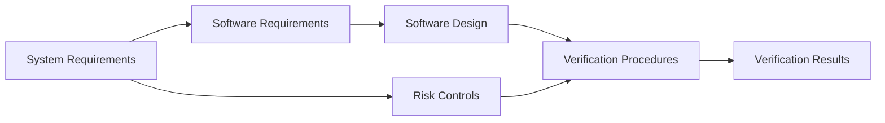

# (PV-TM-01) Traceability Matrix

Document ID: `PV-TM-01`  
Product: `Portview`  
Document Status: `Released`

## Document Overview

This document records the traceability relationships used across the Portview software document set.

Document notes:

- The current matrix content shows requirement and risk linkage and should be normalized into a stable authored format.
- ImageProcess-specific rows are excluded from the current authored scope.

## Document Approval

### Prepared by

| Title | Name | Signature |
| --- | --- | --- |
| Manager | `J. W. Lee` |  |

### Reviewed by

| Title | Name | Signature |
| --- | --- | --- |
| General Manager | `S. I. Choi` |  |

### Approved by

| Title | Name | Signature |
| --- | --- | --- |
| CTO (Director) | `K. Y. Ro` |  |

## Revision History

| Rev. | Date | Description |
| --- | --- | --- |
| `0.1` | `To confirm` | Initial authored traceability matrix entry pending normalization |

## 1. Purpose

This document provides traceability across Portview requirements, risk controls, design allocation, and verification coverage.

## 2. Traceability Model

The intended traceability chain is:

## 3. Current Coverage Areas

The current matrix content shows linkage in the following areas.

| Traceability Area | Relationship |
| --- | --- |
| Risk to requirement | Risk items are linked to system or software requirements |
| Requirement to verification | Requirements are linked to one or more verification activities |
| Risk to verification | Risk-control verification is visible through linked requirement coverage |
| Design to verification | Design allocation is expected to be linked to verification evidence in the authored set |

## 4. Portview-Oriented Matrix Content

The current matrix content visibly covers:

- acquisition and sensor workflow
- patient management and search behavior
- annotation and measurement tools
- DICOM print and DICOM communication
- export and media handling
- device connection and integrity checks
- logging and instability guidance

### 4.1 Observed Risk-To-Requirement Themes

The currently visible matrix rows indicate recurring traceability themes.

| Trace Theme | Typical Relationship |
| --- | --- |
| Acquisition failure | sensor or acquisition failure linked to acquisition and device requirements |
| Patient-data workflow failure | patient registration, search, and retrieval linked to account or patient-management requirements |
| Annotation and measurement failure | annotation hazards linked to viewer-tool requirements |
| Output and communication failure | print, DICOM, export, and media hazards linked to output requirements |
| Device integrity and connectivity failure | USB, driver, and network issues linked to integrity and connectivity requirements |
| Stability and data-handling failure | logging, instability guidance, and transmission problems linked to robustness requirements |

### 4.2 Coverage Boundaries

The authored Portview matrix should keep the following scope boundaries.

- include Portview system and software requirements
- include Portview design allocation and verification references
- include risk items that map directly to Portview workflow or control behavior
- exclude ImageProcess-only processing controls unless explicitly added back into scope

## 5. Authored Matrix Structure

The normalized matrix should use at least the following columns.

| Column | Purpose |
| --- | --- |
| Risk Item | Identifies the hazardous situation, failure mode, or control context |
| Requirement ID | Identifies the authored system or software requirement addressed |
| Design Allocation | Identifies the module or design item implementing the requirement |
| Procedure ID | Identifies the verification procedure used |
| Result Record | Identifies the verification evidence or result record |
| Status | Identifies whether coverage is complete, partial, or pending |

### 5.1 Operating Environment And Access

| RS ID | SRS ID | SDS ID | UTP ID | ITP ID | Risk Item | Status |
| --- | --- | --- | --- | --- | --- | --- |
| `RS-001` | `SRS-001` | `SDS-001` | `UTP-024` | `ITP-002` | `-` | `Linked` |
| `RS-002` | `SRS-036` | — | — | `ITP-001` | `FR-004 context` | `Linked` |

### 5.2 Acquisition And Device Interaction

| RS ID | SRS ID | SDS ID | UTP ID | ITP ID | Risk Item | Status |
| --- | --- | --- | --- | --- | --- | --- |
| `RS-003` | `SRS-006` | `SDS-024` | `UTP-001` | `ITP-008` | `FR-018` | `Linked` |
| `RS-004` | `SRS-009` | `SDS-002` | `UTP-002` | `ITP-010` | `FR-014 context` | `Linked` |
| `RS-005` | `SRS-010` | `SDS-025` | `UTP-003` | `ITP-011` | — | `Linked` |
| `RS-006` | `SRS-030` | `SDS-027` | `UTP-018` | `ITP-032` | — | `Linked` |
| `RS-007` | `SRS-007`, `SRS-031` | `SDS-023`, `SDS-028` | `UTP-005`, `UTP-019` | `ITP-007`, `ITP-031` | `FR-012` | `Linked` |
| `RS-008` | `SRS-008` | `SDS-026` | `UTP-004` | `ITP-012` | `FR-001 context` | `Linked` |
| `RS-009` | `SRS-008`, `SRS-032` | `SDS-026`, `SDS-029` | `UTP-004`, `UTP-020` | `ITP-012` | `FR-012 context` | `Linked` |

### 5.3 Viewing And Diagnostic Interaction

| RS ID | SRS ID | SDS ID | UTP ID | ITP ID | Risk Item | Status |
| --- | --- | --- | --- | --- | --- | --- |
| `RS-010` | `SRS-011` | `SDS-003` | `UTP-006` | `ITP-013` | `FR-002` | `Linked` |
| `RS-010` | `SRS-012` | `SDS-004` | `UTP-012` | `ITP-014` | `FR-002 context` | `Linked` |
| `RS-011` | `SRS-013` | `SDS-005` | `UTP-007` | `ITP-016` | — | `Linked` |
| `RS-012` | `SRS-014` | `SDS-006` | `UTP-008` | `ITP-015` | `-` | `Linked` |
| `RS-013` | `SRS-015` | `SDS-003` | `UTP-009` | `ITP-017` | — | `Linked` |
| `RS-013` | `SRS-016` | `SDS-013` | `UTP-010` | `ITP-018` | — | `Linked` |
| `RS-013` | `SRS-017` | `SDS-014` | `UTP-011` | `ITP-021` | — | `Linked` |
| `RS-014` | `SRS-018` | `SDS-007` | — | `ITP-022` | `FR-013` | `Integration only` |
| `RS-014` | `SRS-019` | `SDS-008` | — | `ITP-022` | `FR-013` | `Integration only` |
| `RS-014` | `SRS-020` | `SDS-009` | — | `ITP-023` | `FR-013` | `Integration only` |
| `RS-014` | `SRS-021` | `SDS-010` | — | `ITP-024` | `FR-013` | `Integration only` |
| `RS-014` | `SRS-022` | `SDS-011` | — | `ITP-025` | `FR-013` | `Integration only` |
| `RS-014` | `SRS-023` | `SDS-012` | — | `ITP-026` | `FR-013` | `Integration only` |

### 5.4 Output And Communication

| RS ID | SRS ID | SDS ID | UTP ID | ITP ID | Risk Item | Status |
| --- | --- | --- | --- | --- | --- | --- |
| `RS-015` | `SRS-024` | `SDS-015` | `UTP-013` | `ITP-027` | `-` | `Linked` |
| `RS-015` | `SRS-025` | `SDS-016` | `UTP-014` | `ITP-028` | `FR-011` | `Linked` |
| `RS-016` | `SRS-026` | `SDS-017` | `UTP-015` | `ITP-006` | `FR-010` | `Linked` |
| `RS-017` | `SRS-027` | `SDS-018` | `UTP-016` | `ITP-029` | `FR-009` | `Linked` |
| `RS-018` | `SRS-028` | `SDS-019` | `UTP-017` | `ITP-030` | `FR-006`, `FR-008` | `Linked` |
| — | `SRS-029` | `SDS-002` | `UTP-002` | `ITP-010` | — | `Linked` |

### 5.5 Integrity, Robustness, And User Guidance

| RS ID | SRS ID | SDS ID | UTP ID | ITP ID | Risk Item | Status |
| --- | --- | --- | --- | --- | --- | --- |
| `RS-019` | `SRS-033` | `SDS-030` | `UTP-021` | `ITP-033` | `FR-007`, `FR-012` | `Linked` |
| `RS-020` | `SRS-034` | `SDS-020` | `UTP-022` | `ITP-034` | `FR-008 context` | `Linked` |
| `RS-021` | `SRS-035` | `SDS-021` | `UTP-023` | `ITP-035` | `FR-004` | `Linked` |
| `RS-022` | `SRS-036` | — | — | `ITP-001` | `FR-004 context` | `Linked` |
| `RS-023` | `SRS-036` | — | — | `ITP-001` | `FR-001`, `FR-012 context` | `Linked` |

### 5.6 Administrative And Localization

| RS ID | SRS ID | SDS ID | UTP ID | ITP ID | Risk Item | Status |
| --- | --- | --- | --- | --- | --- | --- |
| `RS-024` | `SRS-002` | `SDS-001` | `UTP-024` | `ITP-002` | `FR-017` | `Linked` |
| `RS-024` | `SRS-003` | `SDS-001` | `UTP-024` | `ITP-003` | `FR-017` | `Linked` |
| `RS-024` | `SRS-004` | `SDS-001` | `UTP-024` | `ITP-004` | `FR-015` | `Linked` |
| `RS-024` | `SRS-005` | `SDS-001` | `UTP-024` | `ITP-005` | `FR-016` | `Linked` |
| `RS-025` | `SRS-037` | `SDS-022` | `UTP-025` | `ITP-036` | `-` | `Linked` |

### 5.7 System-Level Release Verification

| RS ID | System Procedure ID | System Result ID | Risk Item | Status |
| --- | --- | --- | --- | --- |
| `RS-001`, `RS-002` | `SYSP-001` | `PV-SYSTR-01` | `FR-001`, `FR-002 context` | `Linked at system level` |
| `RS-003` to `RS-009`, `RS-024` | `SYSP-002` | `PV-SYSTR-01` | `FR-012`, `FR-017`, `FR-018` | `Linked at system level` |
| `RS-010` to `RS-014` | `SYSP-003` | `PV-SYSTR-01` | `FR-001`, `FR-002`, `FR-013` | `Linked at system level` |
| `RS-015` to `RS-018` | `SYSP-004` | `PV-SYSTR-01` | `FR-006`, `FR-008`, `FR-009`, `FR-010`, `FR-011` | `Linked at system level` |
| `RS-019`, `RS-020`, `RS-022`, `RS-023` | `SYSP-005` | `PV-SYSTR-01` | `FR-007`, `FR-012` | `Linked at system level` |
| `RS-021`, `RS-025` | `SYSP-006` | `PV-SYSTR-01` | `FR-004 context` | `Linked at system level` |
| `RS-001`, `RS-019`, `RS-020`, `RS-023` | `SYSP-007` | `PV-SYSTR-01` | `FR-003`, `FR-005`, `FR-007` | `Linked at system level` |
| `RS-021`, `RS-023` | `SYSP-008` | `PV-SYSTR-01` | `FR-004` | `Linked at system level` |
| `RS-003`, `RS-010`, `RS-016`, `RS-024` | `SYSP-009` | `PV-SYSTR-01` | `FR-014`, `FR-015`, `FR-016`, `FR-017`, `FR-018 context` | `Linked at system level` |

### 5.8 Coverage Notes

- Annotation and measurement requirements (`SRS-018` to `SRS-023`) are verified at integration level only (`ITP-022` to `ITP-026`); no separate unit procedures exist for these items. **Design decision justification**: Annotation and measurement tools do not operate independently. They require an active patient context, a loaded image set, and a rendered mount state to function. Verifying these tools in isolation at unit level would require simulating the entire viewer environment, producing less meaningful results than verifying them within the integrated viewer workflow where they actually operate. This verification-level allocation is a deliberate design decision under IEC 62304 Class B, where the standard permits justified selection of the appropriate verification level.
- Device Service unit functions are now allocated to individually numbered design items (`SDS-023` to `SDS-030`) in `PV-SDS-01`. The previous design-allocation gap has been resolved.
- System-level verification should be linked through `PV-SYSTP-01` [SystemTP-Z01]((PV-SYSTP-01) SystemTP.md) and `PV-SYSTR-01` [SystemTR-Z01]((PV-SYSTR-01) SystemTR.md).
- Unit-result linkage should use `PV-STR-01` [SwSTR-Z01 for Portview]((PV-STR-01) SwSTR.md).
- Integration-result linkage should use `PV-TR-01` [SwTR-Z01 for Portview]((PV-TR-01) SwTR.md).

## 6. Coverage By Document Set

The authored matrix should connect the current Portview document set as follows.

| Source Document | Matrix Role |
| --- | --- |
| `PV-RS-01` RS for Portview | System-level source requirements |
| `PV-SRS-01` SwSRS for Portview | Software-level source requirements |
| `PV-SDS-01` SwSDS for Portview | Design allocation source |
| `PV-STP-01` SwSTP for Portview | Unit procedure source |
| `PV-TP-01` SwTP for Portview | Integration procedure source |
| `PV-SV-04` Software Verification Plan | Planned verification context |
| `PV-SV-05` Software Verification Report | Executed verification context |

### 6.1 Current Direct Links

The following links are currently available within this workspace.

| Linked Record | Current Link |
| --- | --- |
| System requirements | [PV-RS-01]((PV-RS-01) RS.md) |
| Software requirements | [PV-SRS-01]((PV-SRS-01) SwSRS.md) |
| Software design | [PV-SDS-01]((PV-SDS-01) SwSDS.md) |
| Unit procedure | [PV-STP-01]((PV-STP-01) SwSTP.md) |
| Unit result | [PV-STR-01]((PV-STR-01) SwSTR.md) |
| Integration procedure | [PV-TP-01]((PV-TP-01) SwTP.md) |
| Integration result | [PV-TR-01]((PV-TR-01) SwTR.md) |
| System procedure | [PV-SYSTP-01]((PV-SYSTP-01) SystemTP.md) |
| System result | [PV-SYSTR-01]((PV-SYSTR-01) SystemTR.md) |
| Cybersecurity requirements | [PV-CSRS-01]((PV-CSRS-01) SwRS for Cybersecurity.md) |
| Risks FMEA | [FMEA-Z01]((FMEA-Z01) Risks FMEA.md) |
| Network security enclosure | [NSE-Z01]((NSE-Z01) Network Security Enclosure.md) |
| Verification plan | [PV-SV-04](../sv/(PV-SV-04) Software Verification Plan.md) |
| Verification report | [PV-SV-05](../sv/(PV-SV-05) Software Verification Report.md) |

## 7. Primary Consumers

This traceability matrix is used primarily by:

- `PV-SV-01` for lifecycle evidence and release conclusion
- `PV-SV-02` for lifecycle planning and control discussion
- `PV-SV-03` for design allocation context
- `PV-SV-04` for verification planning
- `PV-SV-05` for executed evidence summary
