# (SDS-603) SwSDS

Document ID: `SDS-603`
Product: `Portview`
Document Status: `Released`


## Document Approval

### Prepared by

| Title | Name | Signature |
| --- | --- | --- |
| Manager | `J. W. Lee` |  |

### Reviewed by

| Title | Name | Signature |
| --- | --- | --- |
| General Manager | `S. I. Choi` |  |

### Approved by

| Title | Name | Signature |
| --- | --- | --- |
| CTO (Director) | `K. Y. Ro` |  |

## Revision History

| Rev. | Date | Description |
| --- | --- | --- |
| `0.0` | `2012.07.02` | Initial version |
| `0.1` | `2015.01.12` | User interface update |
| `0.2` | `2016.01.19` | New function implemented |
| `0.3` | `2017.01.13` | System issue revision |
| `0.4` | `2018.01.12` | New device added |
| `0.5` | `2019.01.21` | Device compatibility update |
| `0.6` | `2020.01.30` | Device compatibility update |
| `0.7` | `2020.10.08` | GUI update |
| `0.8` | `2021.02.26` | Linkage usability improvement |
| `0.9` | `2021.09.10` | Program issue update |
| `1.0` | `2021.10.08` | Device compatibility update |
| `1.1` | `2022.03.04` | Connection-status improvement |
| `1.2` | `2023.01.04` | Increased image capacity |
| `1.3` | `2023.04.21` | Device compatibility update |
| `1.4` | `2024.01.08` | Device compatibility update |
| `1.5` | `2024.01.15` | Document number changed from 603 to Z01 according to OP-709 |
| `1.6` | `2025.08.14` | Updated software architecture and added translation-related design item |

## 1. Purpose

This document describes the software design needed to satisfy the Portview software requirements. It specifies the software architecture, data design, and detailed design of each software unit to a level sufficient for implementation and verification.

## 2. Design Overview

Portview is designed as workstation software for image management, image acquisition, image viewing, and supporting diagnostic workflow operations.

The software is integrated with an image database, image viewer, and image acquisition module. The design separates the software into stable operational units:

- patient management
- device service
- image viewer
- export and communication services
- language-resource support

ImageProcess-specific design content is not carried into the current authored scope.

## 3. System Architecture

### 3.1 Software Architecture

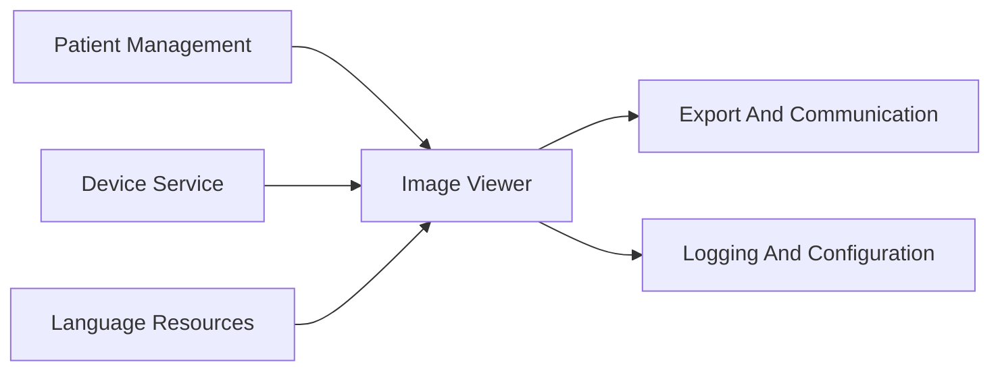

- 1) Patient management unit manages patients' information (add / delete / modify).
- 2) Device service unit checks connectivity between Viewer and modalities.
- 3) Image viewer unit shows images relevant to the selected patient and supports annotations (length, arrow, ellipse, angle).
- 4) Exportation service unit exports images to other types (DICOM files, plain images, burned CD).
- 5) Image viewer should offer GUI translations when the user demands.

### 3.2 Module Responsibilities

| Module | Responsibility |
| --- | --- |
| Patient management unit | Manage patient information including add, delete, and modify operations |
| Device service unit | Check connectivity between the viewer and connected modalities |
| Image viewer unit | Display images and provide diagnostic interaction tools |
| Exportation service unit | Export images and related information to supported destinations |
| Language-resource support | Provide GUI translation support |

### 3.3 Representative Processing Paths

| Processing Path | Design Intent | Primary Modules |
| --- | --- | --- |
| Patient registration and selection | Create, update, select, and reopen patient or study records before image operations start | Patient management, local data store |
| Acquisition and import | Acquire images from supported sensors, file imports, or TWAIN paths and bind them to the active patient context | Device service, patient management, image viewer |
| Mount and viewer reconstruction | Reconstruct the correct mount, image set, and annotation set from stored metadata and file structures | Image viewer, TMI/TII files, local data store |
| Annotation and diagnostic interaction | Create and render annotation objects while preserving image and patient attribution | Image viewer, annotation modules |
| Output and communication | Print, export, burn media, or transmit DICOM payloads while preserving selected-image context | Exportation service, image viewer |
| Logging and support | Record operational events, support troubleshooting, and apply language-resource updates | Logging support, language-resource support |

### 3.4 Inter-Unit Interface Definitions

| Source Unit | Target Unit | Transferred Data | Trigger | Failure Handling |
| --- | --- | --- | --- | --- |
| Patient Management | Image Viewer | `ActivePatientContext` (PatientID, StudyGUID, EquipmentPath) | Patient selection or reopen completed | Viewer receives empty context; display error message |
| Patient Management | Exportation Service | `ActivePatientContext` (PatientID, StudyGUID) | Export action initiated by user | Export aborted; user-visible error |
| Device Service | Image Viewer | `AcquiredImageData` (image buffer, modality metadata, patient binding) | Acquisition completed | Viewer not updated; acquisition error displayed |
| Device Service | Patient Management | `DeviceStatus` (connection state, device identifier) | Device state change detected | Status display updated to disconnected state |
| Image Viewer | Exportation Service | `SelectedImageSet` (image references, current annotations, display metadata) | User initiates print, export, or DICOM send | Export aborted if no image selected; error displayed |
| Image Viewer | Logging Support | `WorkflowEvent` (event type, source module, timestamp) | Any auditable viewer operation | Log failure does not block primary workflow |
| Language Resources | Image Viewer | `LanguagePatch` (resource key-value set, target locale) | User changes GUI language | GUI falls back to default language on patch failure |
| Logging Support | Image Viewer | `TroubleshootingGuidance` (error type, instruction text) | System instability or classified error detected | Generic error message if guidance lookup fails |

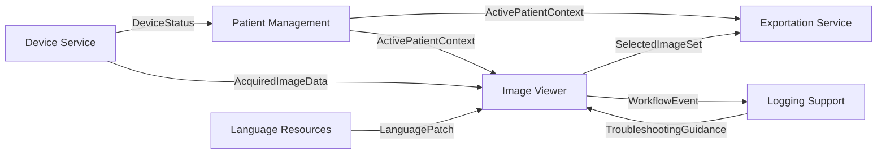

## 4. Data Design

### 4.1 Database Study Table

| Data Group | Representative Fields | Design Use |
| --- | --- | --- |
| Record identity | `IdxStudy`, `StudyInstanceUID`, `GUID`, `BackupGUID` | Stable identity for patient-study records and backup linkage |
| Patient identity | `ID`, `OtherID`, `Name`, `BirthDate`, `Sex`, `Age` | Patient registration, lookup, and demographic display |
| Clinical and workflow context | `StudyDescription`, `BodyPartExamined`, `PerfPrcStepID`, `AccessNumber` | Study meaning and workflow attribution |
| State and storage | `Opened`, `BackupStatus`, `WhereIs`, `BackupHDDID` | Reopen behavior, backup tracking, storage-state management |
| Counts and category | `CountPX`, `CountCX`, `CountOX`, `CountOV`, `CountDC`, `CountCT`, `category` | Acquisition composition and mounted-study organization |
| Contact and address | `Email`, `Address1`, `City`, `StateProvince`, `HomePhone`, `MobilePhone` | Patient-contact and administrative data |

### 4.2 Non-Database Files

| File Structure | Purpose | Representative Fields |
| --- | --- | --- |
| `TMI` (FILM_MOUNT_INFO) | Mounted-image layout | `TYPE`, `GUID`, `WIDTH`, `HEIGHT`, `DIVIDE_COL`, `DIVIDE_ROW`, `IMAGE_FILE` (148 bytes) |
| `TMI` (ITEM) | Mount cell placement | `LEFT`, `TOP`, `RIGHT`, `BOTTOM`, `GUID`, `IMAGE_FILES`, `SELECTED_IMAGE`, `TITLE` (528 bytes) |
| `TII` (IMAGE_INFO) | Extra image metadata | `nImageType`, `nWidth`, `nHeight`, `nUsingBits`, `nInverted`, `nLaterality`, `Comment`, `dCliFactor`, `nW1OffsetToDisp`, `nW2OffsetToDisp` (2038 bytes) |

### 4.3 Persistence And Reconstruction Logic

The viewer reconstructs the active display state from:

- database-managed patient and study records
- mount-layout metadata in `TMI`
- image and calibration metadata in `TII`
- annotation records linked to the selected equipment or image path

## 5. Detailed Design Specifications

### 5.0 Design Allocation Summary

| Design Area | Design Items |
| --- | --- |
| Patient and study handling | `SDS-001` |
| Acquisition and device interaction | `SDS-002`, `SDS-023` to `SDS-030` |
| Viewer presentation | `SDS-003`, `SDS-004`, `SDS-005`, `SDS-006` |
| Image interaction | `SDS-013`, `SDS-014` |
| Annotation and measurement | `SDS-007` to `SDS-012` |
| Output and communication | `SDS-015` to `SDS-019` |
| Support functions | `SDS-020`, `SDS-021`, `SDS-022`, `SDS-031` |

---

### 5.1 Patient And Study Handling

#### SDS-001: Patient Management

| Aspect | Detail |
| --- | --- |
| Input | Patient information (demographics, study metadata, user actions) |
| Output | Persistent patient-study records, active patient context |
| Algorithm | Validate and persist patient data, maintain active record context, expose correct study to downstream modules |

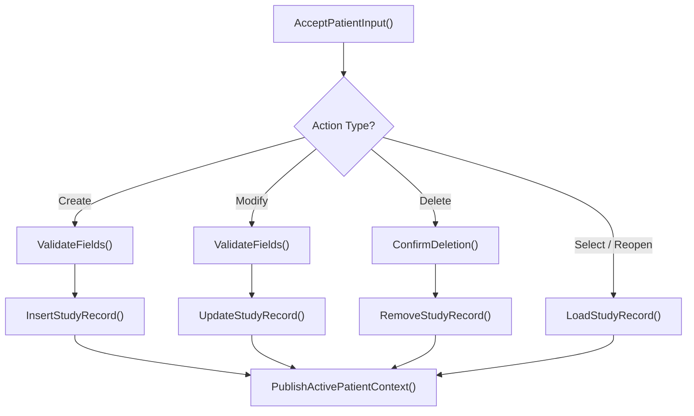

**Sub-process: Patient Management (Import)**

| Aspect | Detail |
| --- | --- |
| Input | External patient data from disc or file |
| Output | Imported patient record bound to local data store |

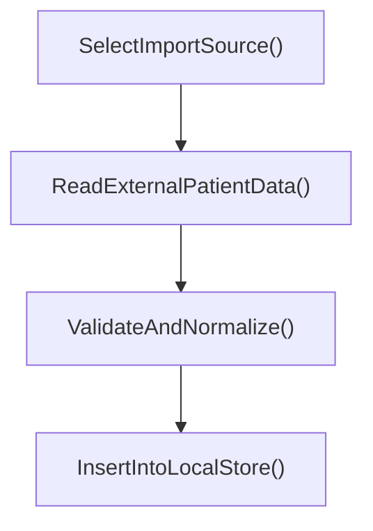

---

### 5.2 Acquisition And Device Interaction

#### SDS-023: Select Device And Acquire Image

| Aspect | Detail |
| --- | --- |
| Input | Available device list, user device selection |
| Output | Active device path, acquired image data |

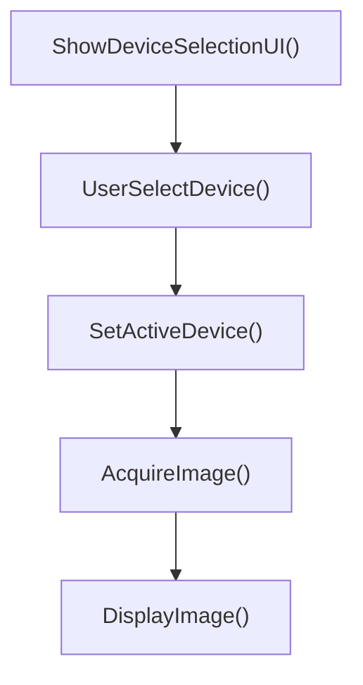

#### SDS-024: Acquire Image From Intraoral Sensor

| Aspect | Detail |
| --- | --- |
| Input | Intraoral sensor signal, selected patient context |
| Output | Image data bound to active patient |
| Error handling | Sensor timeout, sensor not responding, patient context missing |

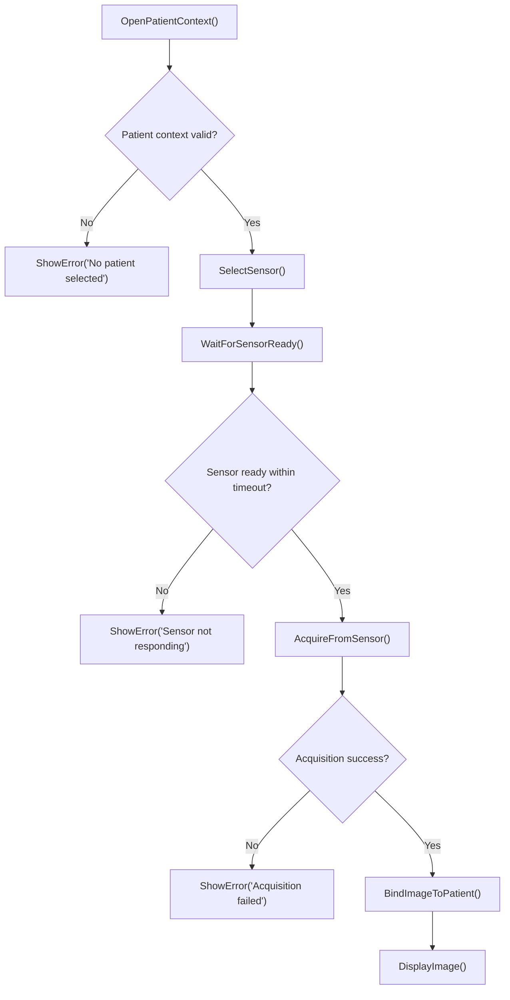

#### SDS-002: Acquire Image From File

| Aspect | Detail |
| --- | --- |
| Input | File path |
| Output | Image bound to active patient |
| Error handling | File not found, unsupported format, patient context missing |

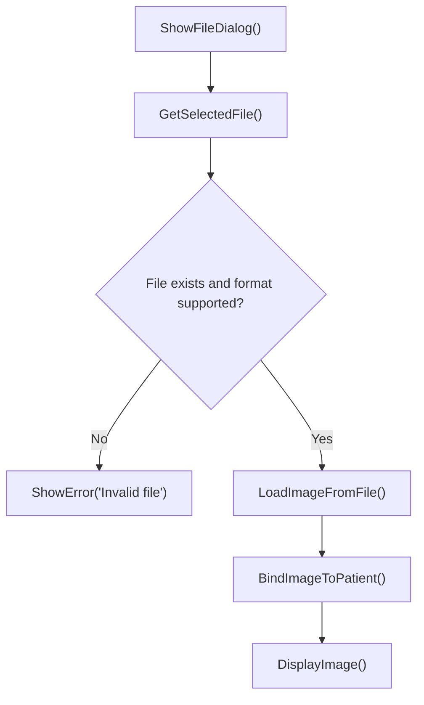

#### SDS-025: Acquire Image From TWAIN Device

| Aspect | Detail |
| --- | --- |
| Input | TWAIN device signal |
| Output | Image bound to active patient |

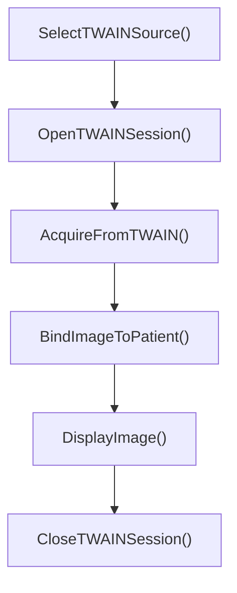

#### SDS-026: Show Status Of Device

| Aspect | Detail |
| --- | --- |
| Input | Selected device, connection state |
| Output | Device status display |

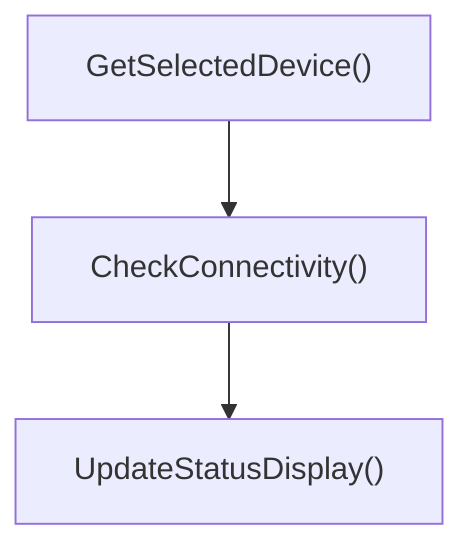

#### SDS-027: Change FMX Continuous Acquisition Mode

| Aspect | Detail |
| --- | --- |
| Input | Preset order, FMX layout |
| Output | Sequential acquisition workflow |

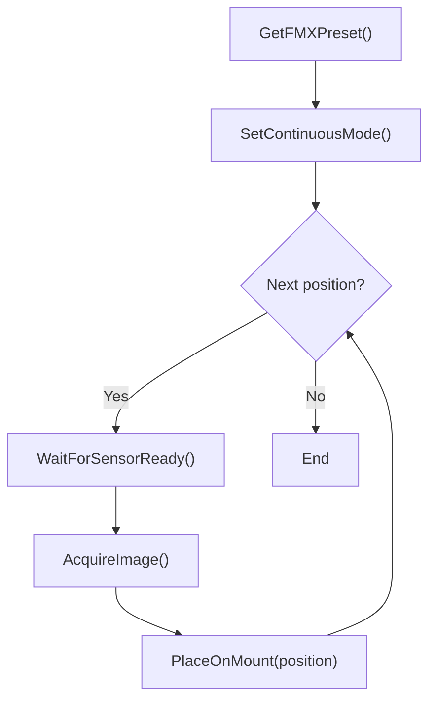

#### SDS-028: Multi-Sensor Select

| Aspect | Detail |
| --- | --- |
| Input | Sensor connection signals |
| Output | Acquisition image from selected sensor |

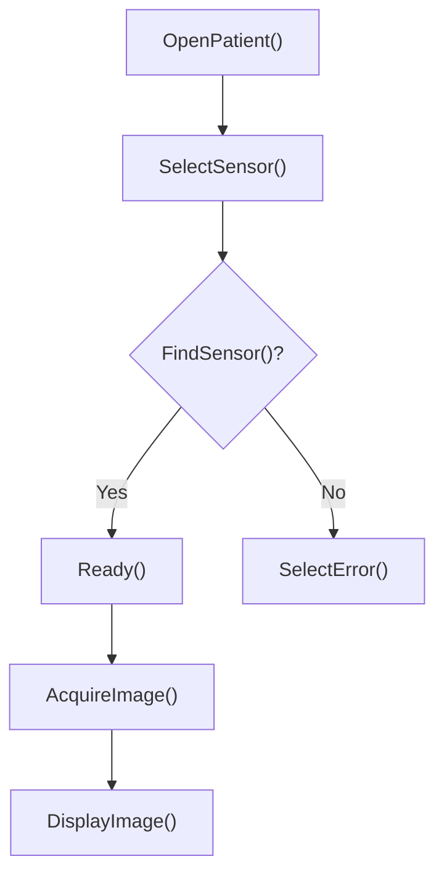

#### SDS-029: Intraoral Sensor Acquisition Wait Display

| Aspect | Detail |
| --- | --- |
| Input | Sensor readiness state |
| Output | Wait-state display to user |

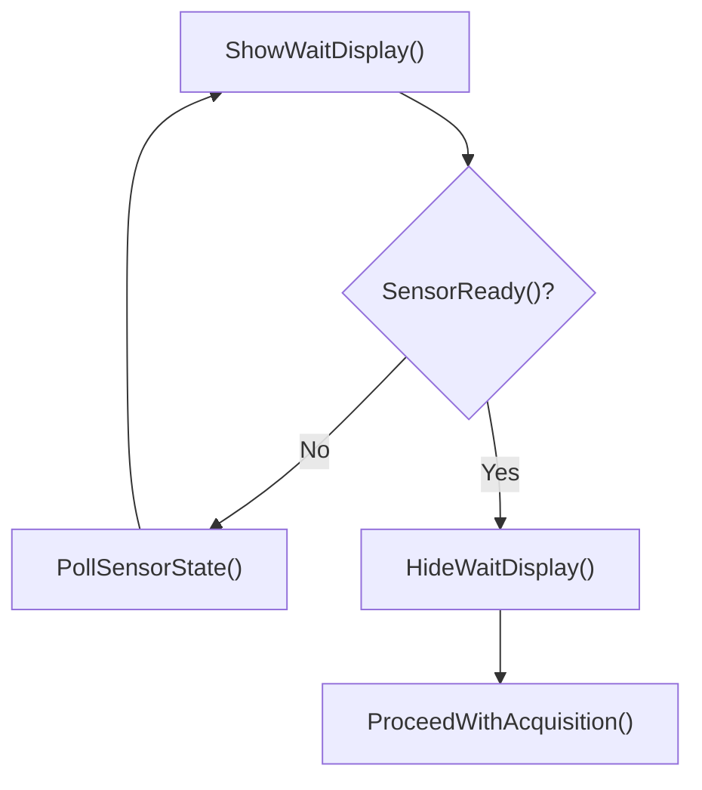

#### SDS-030: USB Data Integrity Check

| Aspect | Detail |
| --- | --- |
| Input | USB drive |
| Output | Result of the integrity check |

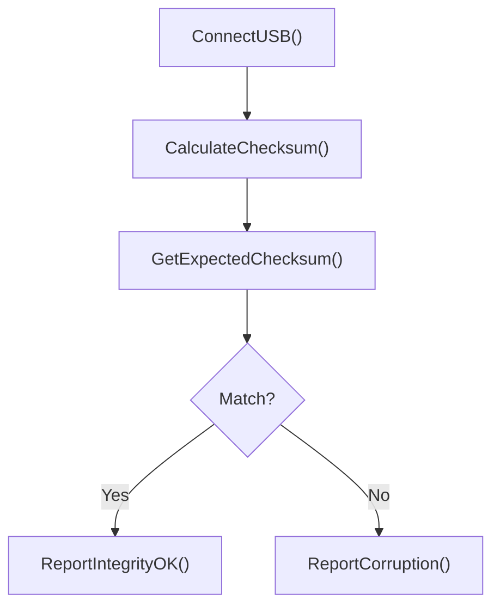

---

### 5.3 Viewer Presentation

#### Viewer State Model

The Main Viewer operates through the following state transitions:

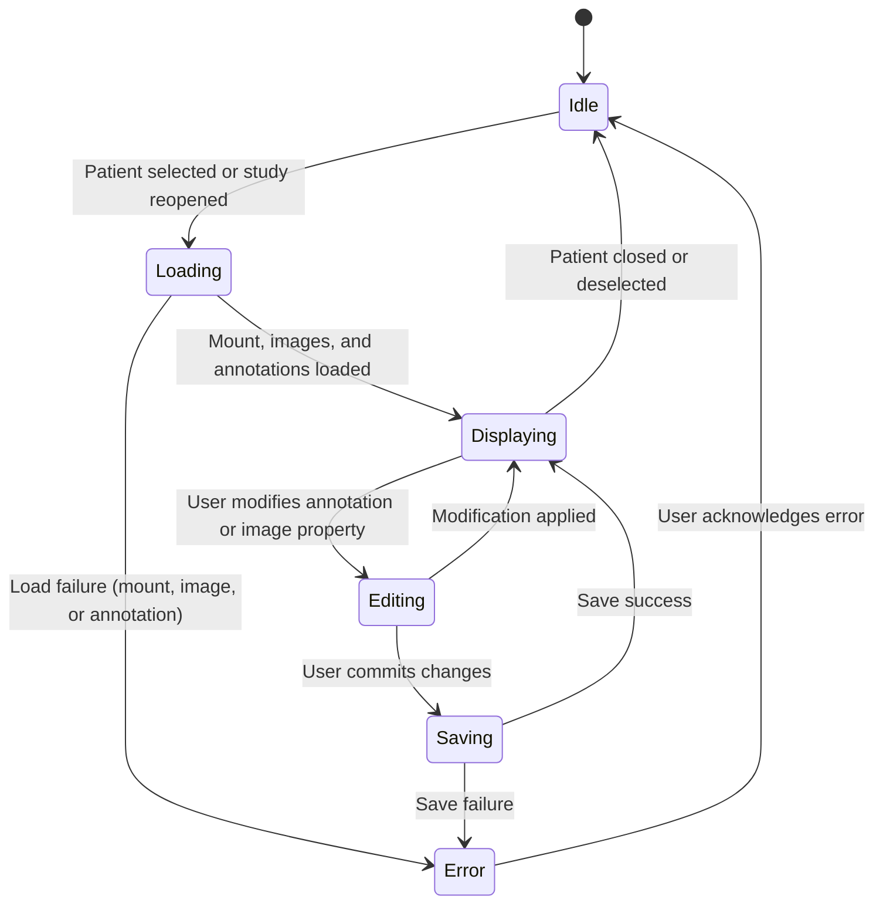

| State | Description |
| --- | --- |
| Idle | No patient context active; viewer is empty |
| Loading | Reconstructing mount, images, and annotations from stored metadata |
| Displaying | Active patient images and annotations rendered on mount |
| Editing | User is modifying annotation geometry, text, or image display properties |
| Saving | Committing modified image info and annotation info to persistent storage |
| Error | A load or save failure has occurred; user action required to recover |

#### SDS-003: Main Viewer

| Aspect | Detail |
| --- | --- |
| Input | Patient image path, mount metadata, annotation metadata |
| Output | Display images and annotations on mount |
| Error handling | Mount load failure, image load failure, annotation load failure, save failure |

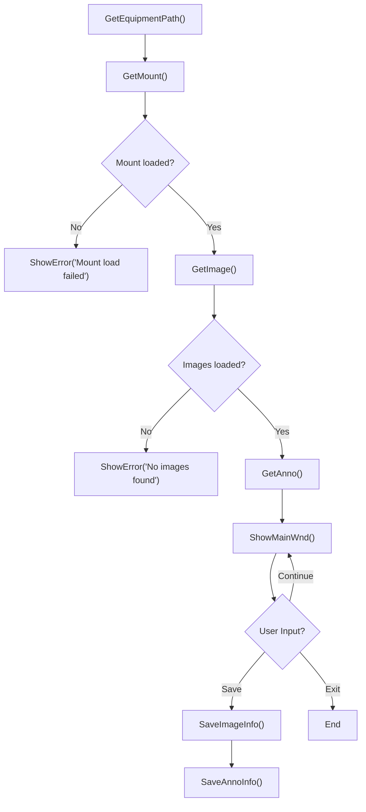

**Sub-process: GetAnno**

| Aspect | Detail |
| --- | --- |
| Input | Equipment path |
| Output | Created annotation objects |

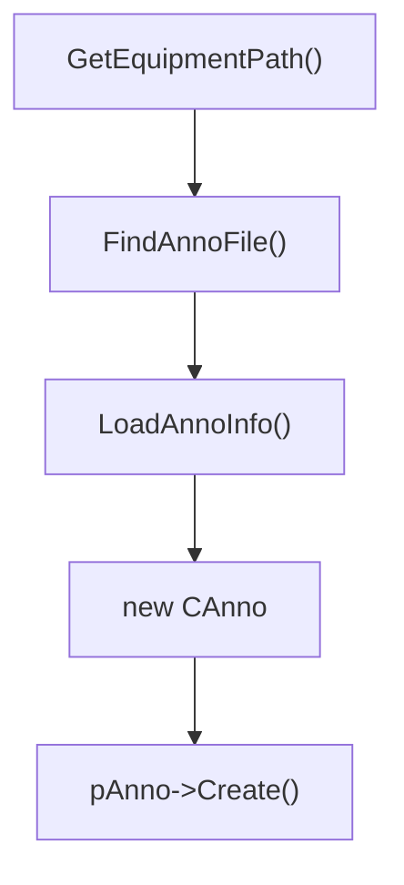

**Sub-process: GetMount**

| Aspect | Detail |
| --- | --- |
| Input | Equipment path |
| Output | Created mount template |

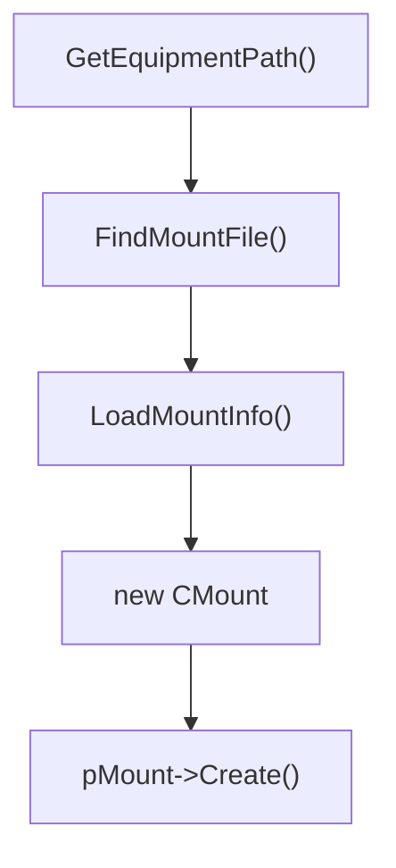

**Sub-process: GetImage**

| Aspect | Detail |
| --- | --- |
| Input | Equipment path |
| Output | Created image objects |

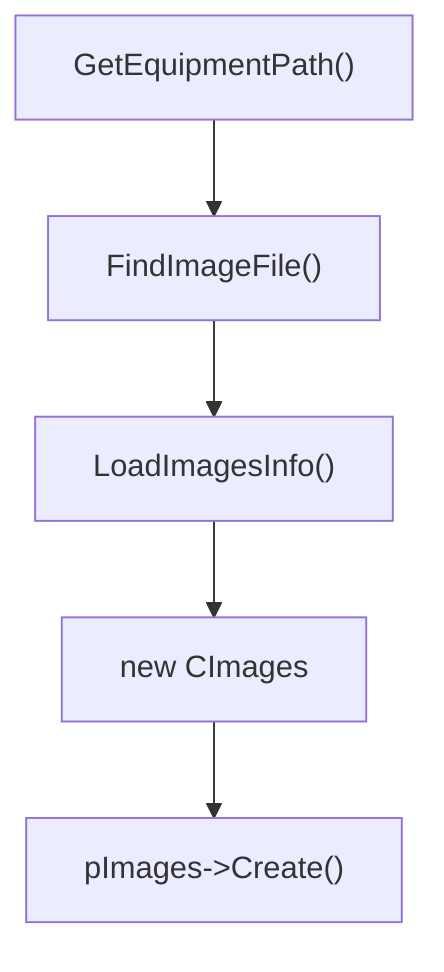

**Sub-process: ShowMainWnd / ShowMainWndImages**

| Aspect | Detail |
| --- | --- |
| Input | Equipment type properties |
| Output | Rendered images and annotations |

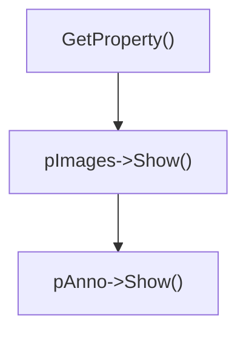

**Sub-process: Image Move**

| Aspect | Detail |
| --- | --- |
| Input | Image and X, Y position value |
| Output | Changed image position property |

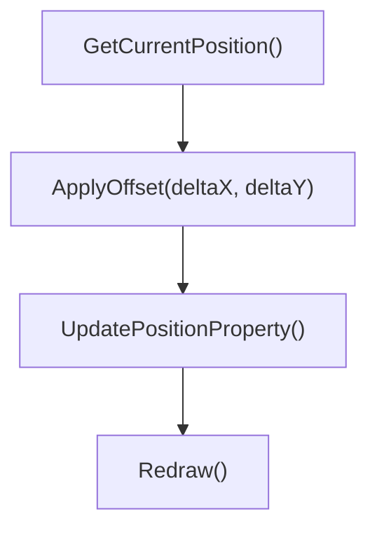

#### SDS-004: Thumbnail Viewer

| Aspect | Detail |
| --- | --- |
| Input | Patient image path |
| Output | Displayed thumbnail images |
| Error handling | No images available for selected patient |

```mermaid
flowchart TD
    A["GetPatientPath()"] --> B["GetEquipmentPath()"]
    B --> C["GetImage()"]
    C --> C1{"Images available?"}
    C1 -->|"No"| C2["ShowEmptyThumbnailState()"]
    C1 -->|"Yes"| D{"bShowThumbnailWnd?"}
    D -->|"Yes"| E["ShowThumbnailImages()"]
    E --> F{"UserInput() == End?"}
    F -->|"No"| D
    F -->|"Yes"| G["End"]
    D -->|"No"| F
```

#### SDS-005: ToothMapWnd

| Aspect | Detail |
| --- | --- |
| Input | Mounted-study layout and selected exam type |
| Output | Structured mount or tooth-map view |

```mermaid
flowchart TD
    A["GetMountLayout()"] --> B["MapToothPositions()"]
    B --> C["RenderToothMap()"]
    C --> D{"User selects position?"}
    D -->|"Yes"| E["NavigateToImage(position)"]
    E --> C
    D -->|"No"| F["End"]
```

#### SDS-006: Compare Viewer

| Aspect | Detail |
| --- | --- |
| Input | Selected images, user compare action |
| Output | Compared images display |

```mermaid
flowchart TD
    A["GetSelectedImages()"] --> B["GetMountType()"]
    B --> C["SetTypeMount()"]
    C --> D["ShowMount()"]
    D --> E["ShowCompareImages()"]
```

**Sub-process: Show Compare Mount**

```mermaid
flowchart TD
    A["GetMountType()"] --> B["SetTypeMount()"]
    B --> C["ShowMount()"]
```

**Sub-process: Show Compare Image**

```mermaid
flowchart TD
    A["GetSelectedCompareImages()"] --> B["RenderSideBySide()"]
```

---

### 5.4 Image Interaction

#### SDS-013: Image Zoom

| Aspect | Detail |
| --- | --- |
| Input | Image and zoom parameter |
| Output | Changed image zoom property |

```mermaid
flowchart TD
    A["GetCurrentZoom()"] --> B["ApplyZoomFactor(factor)"]
    B --> C["UpdateZoomProperty()"]
    C --> D["Redraw()"]
```

#### SDS-014: Image Rotate

| Aspect | Detail |
| --- | --- |
| Input | Image and rotate parameter |
| Output | Changed image rotate property |

```mermaid
flowchart TD
    A["GetCurrentRotation()"] --> B["ApplyRotation(angle)"]
    B --> C["UpdateRotateProperty()"]
    C --> D["Redraw()"]
```

---

### 5.5 Annotation And Measurement

#### SDS-007: Ellipse

| Aspect | Detail |
| --- | --- |
| Input | Annotation and ellipse parameter |
| Output | Changed annotation ellipse property |

```mermaid
flowchart TD
    A["GetEllipseParam(center, radius)"] --> B["SetAnnoProperty(ELLIPSE, ...)"]
    B --> C["Redraw()"]
```

#### SDS-008: Text

| Aspect | Detail |
| --- | --- |
| Input | Annotation and text parameter |
| Output | Changed annotation text property |

```mermaid
flowchart TD
    A["GetTextParam()"] --> B["SetTextProperty(TEXT, x, y, strText)"]
```

#### SDS-009: Arrow

| Aspect | Detail |
| --- | --- |
| Input | Annotation and arrow parameter |
| Output | Changed annotation arrow property |

```mermaid
flowchart TD
    A["GetArrowParam(start, end)"] --> B["SetAnnoProperty(ARROW, ...)"]
    B --> C["Redraw()"]
```

#### SDS-010: Pencil

| Aspect | Detail |
| --- | --- |
| Input | Annotation and pencil parameter |
| Output | Changed annotation pencil property |

```mermaid
flowchart TD
    A["GetPencilParam()"] --> B["SetAnnoProperty(PENCIL, x, y)"]
```

#### SDS-011: Angle

| Aspect | Detail |
| --- | --- |
| Input | Annotation and angle parameter |
| Output | Changed annotation angle property |

```mermaid
flowchart TD
    A["GetAngleParam(p1, vertex, p2)"] --> B["SetAnnoProperty(ANGLE, ...)"]
    B --> C["Redraw()"]
```

#### SDS-012: Length

| Aspect | Detail |
| --- | --- |
| Input | Annotation and length parameter |
| Output | Calibrated length measurement |

```mermaid
flowchart TD
    A["GetLengthParam(start, end)"] --> B["CalculateLength(start, end, dCliFactor)"]
    B --> C["SetAnnoProperty(LENGTH, ...)"]
    C --> D["Redraw()"]
```

---

### 5.6 Output And Communication

#### SDS-015: Print Image

| Aspect | Detail |
| --- | --- |
| Input | Selected image |
| Output | Print job or error message |

```mermaid
flowchart TD
    A["ShowPrintDialog()"] --> B["GetOptions()"]
    B --> C{"isImageExist()?"}
    C -->|"Yes"| D["TransmitImage()"]
    C -->|"No"| E["ShowError()"]
```

#### SDS-016: Print Image To DICOM Printer

| Aspect | Detail |
| --- | --- |
| Input | Selected image, DICOM printer configuration |
| Output | DICOM print request or error message |

```mermaid
flowchart TD
    A["ShowPrintDialog()"] --> B["GetOptions()"]
    B --> C{"isImageExist()?"}
    C -->|"No"| D["ShowMsgBox()"]
    C -->|"Yes"| E{"isConnectedDicomPrint()?"}
    E -->|"No"| F["ShowMsgBox()"]
    E -->|"Yes"| G["TransmitImageToDICOM_Printer()"]
```

#### SDS-017: Export Image To File

| Aspect | Detail |
| --- | --- |
| Input | Image |
| Output | Exported image file |
| Error handling | No image selected, target path invalid, conversion failure |

```mermaid
flowchart TD
    A["ShowExportDialog()"] --> B["GetOptions()"]
    B --> C{"isImageExist()?"}
    C -->|"No"| D["ShowError('No image selected')"]
    C -->|"Yes"| E{"Target path valid?"}
    E -->|"No"| F["ShowError('Invalid path')"]
    E -->|"Yes"| G["ConvertImageToFile()"]
```

#### SDS-018: Export Image To CD

| Aspect | Detail |
| --- | --- |
| Input | Selected image set, media destination |
| Output | Burned media or error |
| Error handling | No image selected, media not available, burn failure |

```mermaid
flowchart TD
    A["ShowMediaExportDialog()"] --> B["GetOptions()"]
    B --> C{"isImageExist()?"}
    C -->|"No"| D["ShowError('No image selected')"]
    C -->|"Yes"| E["PrepareImageSet()"]
    E --> F{"Media available?"}
    F -->|"No"| G["ShowError('Media not available')"]
    F -->|"Yes"| H["BurnToMedia()"]
```

#### SDS-019: SendImageToDicomServer

| Aspect | Detail |
| --- | --- |
| Input | Image |
| Output | DICOM transmission result |

```mermaid
flowchart TD
    A["GetDicomServerConfig()"] --> B{"isConnected()?"}
    B -->|"No"| C["ShowError()"]
    B -->|"Yes"| D["PackageDicomPayload()"]
    D --> E["TransmitToServer()"]
    E --> F["ConfirmTransmission()"]
```

---

### 5.7 Support Functions

#### SDS-020: Local Network Connection

| Aspect | Detail |
| --- | --- |
| Input | Local connection state, device reachability |
| Output | Verified connection state or failure report |

```mermaid
flowchart TD
    A["CheckLocalConnect()"] --> B{"Connected?"}
    B -->|"Yes"| C["Proceed"]
    B -->|"No"| D["ReportConnectionFailure()"]
```

#### SDS-021: Logging Activity

| Aspect | Detail |
| --- | --- |
| Input | Any operations, workflow transitions, error conditions |
| Output | Audit-relevant log records |

```mermaid
flowchart TD
    A["CaptureEvent(source, eventType)"] --> B["GetTimestamp()"]
    B --> C["FormatLogEntry(source, eventType, timestamp, status)"]
    C --> D["WriteToLogFile()"]
```

#### SDS-022: Patch Language File

| Aspect | Detail |
| --- | --- |
| Input | Selected language resource, patch request |
| Output | Updated GUI language display |

```mermaid
flowchart TD
    A["GetSelectedLanguage()"] --> B["LoadLanguageResource()"]
    B --> C["ApplyPatch()"]
    C --> D["RefreshGUILabels()"]
```

#### SDS-031: Check For Instability

| Aspect | Detail |
| --- | --- |
| Input | Any operations |
| Output | Error type specification and troubleshooting instructions |

When an error occurs, the system must specify the type of error and provide a solution. Appropriate instructions or guidelines must be provided in case of system failure.

```mermaid
flowchart TD
    A["RecordLog()"] --> B["ClassifyError()"]
    B --> C["GetTroubleshootingGuidance(errorType)"]
    C --> D["DisplayErrorAndGuidance(errorType, instructions)"]
```

---

## 6. Interface And Platform Assumptions

The design assumes:

- a supported Windows workstation environment
- supported acquisition-device connectivity
- file and communication interfaces for export, print, and DICOM exchange
- persistent local storage for patient and study data

### 6.1 External Interface Contracts

| Interface Type | Design Expectation |
| --- | --- |
| Sensor and modality interface | Device service must confirm connectivity and acquisition readiness before image display is attempted |
| File import interface | Imported files must be normalized into the patient-study context before viewer reconstruction occurs |
| DICOM print interface | Output module must check image availability and print options before transmission |
| DICOM server interface | Output module must package and send the selected image set using the configured communication path |
| Local storage interface | Database, `TMI`, and `TII` data must remain mutually consistent so reopened studies reconstruct correctly |
| Language-resource interface | GUI text resources must be patchable without changing patient data or image content |

### 6.2 Failure-Handling Expectations

- Selected image missing at print or export time
- Device not found or driver unavailable
- Patient record cannot be reopened from storage
- Local or network connection state prevents intended operation
- System instability requires a logged event and troubleshooting guidance

## 7. Design Verification

The detailed design described in this document is verified through:

- **Code review**: Completed before unit-level verification as defined in `SV-603-04` Section 5.2
- **Unit verification**: Each design item is verified through the corresponding unit test procedure in `STP-603`
- **Traceability verification**: Design-to-requirement and design-to-test linkage is maintained through `TM-603`
- **Design walkthrough**: Architecture and inter-unit interface definitions are reviewed as part of the lifecycle review gates defined in `SV-603-02` Section 5.1

## 8. Design Use In The SV Set

This design document is intended to support:

- architecture and module allocation in `SV-603-03`
- validation-basis discussion in `SV-603-01`
- traceability linkage between requirements, design, and verification in `TM-603`
