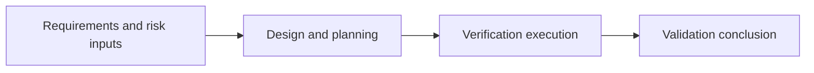

# (SV-603-01) Software Validation Report

Document ID: `SV-603-01`  
Product: `Portview`  
Document Status: `Released`

## Document Approval

### Prepared by

| Title | Name | Signature |
| --- | --- | --- |
| General Manager | `S. I. Choi` |  |
| Manager | `M. C. Boo` |  |
| Deputy General Manager | `C. H. Lee` |  |

### Reviewed by

| Title | Name | Signature |
| --- | --- | --- |
| Deputy General Manager | `H. S. Park` |  |

### Approved by

| Title | Name | Signature |
| --- | --- | --- |
| CTO (Director) | `K. Y. Ro` |  |

## Revision History

| Rev. | Date | Description |
| --- | --- | --- |
| `0.0` | `2012.07.02` | Initial Version |
| `0.1` | `2015.01.12` | User Interface Update |
| `0.2` | `2016.01.19` | New Function Implemented |
| `0.3` | `2017.01.13` | System Issue |
| `0.4` | `2018.01.12` | New Device Added |
| `0.5` | `2019.01.21` | Device Compatibility |
| `0.6` | `2020.01.30` | Device Compatibility |
| `0.7` | `2020.10.08` | GUI update |
| `0.8` | `2021.02.26` | Linkage usability improve |
| `0.9` | `2021.09.10` | Program Issue |
| `1.0` | `2021.10.08` | Device Compatibility |
| `1.1` | `2022.03.04` | Connection status improve |
| `1.2` | `2023.01.04` | Increasing image capacity |
| `1.3` | `2023.04.21` | Device Compatibility |
| `1.4` | `2023.08.29` | Update software version history |
| `1.5` | `2024.01.08` | Device Compatibility |
| `1.6` | `2024.02.23` | Document number changed from 603 to Z01 according to OP-709 |
| `1.7` | `2025.08.14` | Revised according to the changed software architecture |
| `1.8` | `2025.09.09` | Update software version history |
| `1.9` | `2025.11.11` | Update software version history |

## 1. Purpose

This document describes the software validation basis for Portview and demonstrates that the software supports its intended diagnostic workflow, safety objectives, and release expectations.

The report is intended to:

- describe the Portview software functions relevant to validation
- summarize the document set used to support validation
- identify the released software history and unresolved anomaly status
- provide the release conclusion for the covered software baseline

## 2. Scope

This report covers the Portview PC application used to acquire, view, manage, and export intraoral imaging data.

In scope:

- Portview feature description and software role
- lifecycle evidence relevant to validation
- verification and validation document references
- software version history
- unresolved anomaly status and release conclusion

The current released software history includes version `2.2.5.16`, dated `2024-10-02`, with Windows 11 and GenX-CR compatibility updates.

## 3. Referenced Documents

The following references support this validation report.

| Reference | Use |
| --- | --- |
| Medical Device Regulation (EU) 2017/745 | Regulatory framework |
| Quality management systems - Requirements | Quality-system reference |
| EN ISO 13485:2016 Medical devices Quality management systems | Governing quality management standard |
| EN 60601-1:2006/A1:2013 Medical electrical equipment | Basic safety and essential performance reference |
| ISO 12052:2006 DICOM including workflow and data management | Governing interoperability standard |
| IEC 62304:2006/AMD1:2015 Software lifecycle processes | Governing software lifecycle standard |
| Guidance for the Content of Premarket Submissions for Software Contained in Medical Devices | Regulatory guidance |
| General Principles of Software Validation Final Guidance for Industry and FDA Staff | Regulatory guidance |
| Software and Medical Devices (VdTUV, 2001) | External guidance reference |
| QM Quality Manual | Internal quality reference |
| QM Design and Development Management Procedure | Internal process reference |
| QM Design Change Management Procedure | Internal process reference |
| QM Software Validation Procedure | Internal process reference |
| QM Service and Customer Complaint Procedure | Internal process reference |
| QM Document Management Procedure | Internal process reference |
| `SV-603-02` Software Development Planning | Development planning reference |
| `SV-603-03` Software High Level Design | Architecture reference |
| `SV-603-04` Software Verification Plan | Verification planning reference |
| `SV-603-05` Software Verification Report | Verification result reference |
| `TM-603` Traceability Matrix | Requirement and risk traceability reference |
| `CSRS-603` SwRS for Cybersecurity | Cybersecurity control baseline |
| `PV-NSE-01` Network Security Enclosure | Cybersecurity verification enclosure |
| `PV-FMEA-01` Risks FMEA | Authored residual-risk and hazard reference |

## 4. Portview Software Description

Portview is an intraoral imaging application that acquires dental images, supports image viewing and patient-data workflows, and provides export functions for downstream use.

### 4.1 Device Feature

Portview acquires images from supported intraoral sensor systems and provides a user interface intended to support efficient 2D image review and diagnosis.

### 4.2 Role of Software

Portview acts as the parent software item for the user-facing PC application. Within the current scope, the principal Portview units are summarized below.

| Unit | Description |
| --- | --- |
| Image Viewer | Displays images and provides zoom, measurement, annotation, and image-adjustment functions |
| Patient Management | Registers, updates, stores, loads, and manages patient information |
| Device Service | Manages modality connectivity and image acquisition workflows |
| Exportation Service | Exports images to supported formats such as DICOM files, plain image files, and removable media workflows |

### 4.3 Roles And Responsibilities

| Activity Area | Name | Position | Responsibility |
| --- | --- | --- | --- |
| Management | `K. Y. Ro` | CTO (Director) of R&D Center | Approves validation direction and released document set |
| Hazard Analysis | `C. H. Lee` | Deputy General Manager of R&D Center | Maintains hazard-analysis review |
| Hazard Analysis | `H. S. Park` | Deputy General Manager of R&D Center | Reviews risk and anomaly impact |
| Hazard Analysis | `S. R. Lim` | Manager of R&D Center | Supports risk-review and software assessment activities |
| Verification and validation testing | `J. B. Kim` | Staff of R&D Center | Executes and records validation-related activities |
| Documentation review | `C. H. Lee` | Deputy General Manager of R&D Center | Reviews controlled validation records |
| Documentation review | `H. S. Park` | Deputy General Manager of R&D Center | Reviews released validation content |

## 5. Safety Classification And Level Of Concern

The software device is treated as a `Moderate` level of concern because a malfunction or design flaw may lead to an erroneous diagnosis or a delay in delivery of appropriate medical care that could lead to minor injury.

Within the Portview unit structure, the current design evidence supports Class `A` and Class `B` software units depending on the associated risk severity.

| Classification Topic | Assessment |
| --- | --- |
| FDA level of concern | `Moderate` |
| Portview software-unit safety classes | `A` and `B` |
| Principal harm context | Delay of diagnosis and non-serious injury scenarios |

For Class `B` software items, the design and validation approach is intended to ensure that the impact of software errors on users is minimized through architecture controls, rigorous verification, code review, and released validation evidence.

## 6. Lifecycle Evidence Set

The Portview validation basis is supported by the controlled document set below.

| Area | Primary Evidence |
| --- | --- |
| Development planning | `SV-603-02` Software Development Planning |
| High-level design | `SV-603-03` Software High Level Design |
| Requirement definition | `RS-603` RS for Portview, `SRS-603` SwSRS for Portview |
| Design specification | `SDS-603` SwSDS for Portview |
| Traceability | `TM-603` Traceability Matrix |
| Verification planning | `SV-603-04` Software Verification Plan |
| Verification execution | `STP-603` SwSTP for Portview, `STR-603` SwSTR-Z01 for Portview, `TR-603` SwTR-Z01 for Portview, `SystemTR-603` SystemTR-Z01 |
| Cybersecurity controls | `CSRS-603` SwRS for Cybersecurity, `PV-NSE-01` Network Security Enclosure |
| Risk management | `PV-FMEA-01` Risks FMEA and related risk-management references |

### 6.1 Validation Evidence Structure

The validation basis is assembled from controlled lifecycle records rather than from a single test report alone. The evidence chain is expected to show that:

- development activities were planned and controlled
- requirements were documented and traced into design and verification records
- verification procedures were defined before execution
- released verification results support the final validation statement
- risk controls and residual-risk evaluation remain aligned with the covered release baseline

## 7. Validation And Verification Summary

Validation is supported by the lifecycle document set, requirement traceability, controlled verification procedures, released execution records, and residual-risk review.

| Topic | Summary |
| --- | --- |
| Software development planning | Documented in `SV-603-02` |
| Software requirements and architecture | Documented in `SV-603-03` and controlled requirement specifications |
| Traceability | Maintained through `TM-603` and linked validation records |
| Verification planning and execution | Covered by `SV-603-04`, `SV-603-05`, and released unit/integration/system records |
| Risk and anomaly review | Covered by `PV-FMEA-01`, cybersecurity references, and unresolved anomaly review |

### 7.1 Validation Coverage

The validation basis covers the following lifecycle areas.

| Validation Area | Coverage Statement |
| --- | --- |
| Software development planning | Controlled planning is documented in `SV-603-02` |
| Software requirements | Requirement inputs are maintained through `RS-603` and `SRS-603` |
| Architecture and design | Architecture and decomposition are documented in `SV-603-03` and `SDS-603` |
| Verification planning | Verification planning and acceptance logic are documented in `SV-603-04` |
| Verification results | Released execution outcomes are summarized in `SV-603-05` and related procedure/result records |
| Risk and anomaly disposition | `PV-FMEA-01`, `CSRS-603`, `PV-NSE-01`, and anomaly status are reviewed as part of validation closure |

### 7.2 Risk And Residual-Risk Coverage

| Coverage Topic | Controlled Reference |
| --- | --- |
| Product risk normalization | `PV-FMEA-01` Risks FMEA |
| Cybersecurity control baseline | `CSRS-603` SwRS for Cybersecurity |
| Cybersecurity-focused verification | `PV-NSE-01` Network Security Enclosure |
| Requirement and result linkage | `TM-603` Traceability Matrix |

- `FR-xxx` risk items in `PV-FMEA-01` should remain traceable to requirements and released verification records.
- cybersecurity controls in `CSRS-603` should remain linked to verification and residual-risk review.
- validation closure should not rely on unlinked or title-only risk references.

## 8. Software Version History

The released Portview software history recorded for validation is summarized below.

| Version | Date | Reason Of Change | Remark |
| --- | --- | --- | --- |
| `1.0.0.0` | `2012.08.13` | Firstly prepared |  |
| `2.2.5.4` | `2020.02.24` | Reduce sensor noise |  |
| `2.2.5.5` | `2020.03.09` | Improve sensor recognizing |  |
| `2.2.5.6` | `2020.05.11` | Improve image processing |  |
| `2.2.5.7` | `2020.08.19` | Change images sequence |  |
| `2.2.5.8` | `2020.10.06` | Add full series mount |  |
| `2.2.5.9` | `2021.03.02` | Resolve the mount issue |  |
| `2.2.5.10` | `2021.09.10` | Add software filter |  |
| `2.2.5.11` | `2021.10.25` | Display UDI code |  |
| `2.2.5.12` | `2022.03.04` | Connection sequence update | For GTIS sensor |
| `2.2.5.13` | `2022.12.28` | Add FMX32 mount |  |
| `2.2.5.14` | `2023.03.02` | Data folder information |  |
| `2.2.5.15` | `2024.01.10` | Improve modalities' connectivity |  |
| `2.2.5.16` | `2024.10.02` | Add newer OS (Windows 11), GenX-CR compatibility | For GenX-CR |
| `2.2.5.17` | `2024.11.26` | Fix bugs, refactoring internal codes | Internal version |
| `2.2.5.18` | `2025.02.19` | Add sensor support | For Handy sensor; internal version |
| `2.2.5.19` | `2025.09.09` | Fix bugs, refactoring internal codes |  |
| `2.2.5.20` | `2025.11.11` | Apply requests from GAI department |  |

## 9. Unresolved Anomalies

No Portview-specific unresolved anomaly table is currently embedded in this document body. Any unresolved anomaly carried into release should be linked to the controlled anomaly list, risk evaluation, and user communication records.

| Item | Status | Notes |
| --- | --- | --- |
| Portview unresolved anomaly summary | `No anomaly table embedded` | Link controlled anomaly records if applicable |
| User communication requirement | `Applicable when unresolved anomalies remain` | Device labeling and user communication should reflect approved dispositions |

### 9.1 Anomaly Governance

The validation conclusion assumes that:

- unresolved anomalies affecting safety or effectiveness are identified and evaluated before release
- approved dispositions are reflected in the controlled anomaly and risk records
- user communication is updated when unresolved anomalies require operational awareness after release

## 10. Conclusion

The Portview software has been evaluated through the planned verification and validation activities, the identified risks have been reduced to acceptable levels through the applicable controls, and the residual-risk balance supports release of the covered software baseline.

The validation basis supports release on the following grounds:

- the controlled lifecycle document set establishes planning, design, verification, and release evidence
- the software history and covered release baseline are identified within the controlled records
- the available anomaly and risk information does not identify a Portview-specific unresolved issue that blocks release

## 11. IEC 62304 Compliance Summary

The Portview document set is intended to support compliance with the applicable IEC 62304 lifecycle clauses through the controlled records listed below.

| IEC 62304 Topic | Primary Deliverable Mapping |
| --- | --- |
| Software development planning | `SV-603-02` Software Development Planning |
| Software safety classification | `SV-603-01` Software Validation Report |
| Software requirements analysis | `RS-603`, `SRS-603`, and `TM-603` traceability records |
| Software architectural design | `SV-603-03` Software High Level Design |
| Software detailed design and implementation | `SDS-603` and controlled build and implementation records |
| Software verification | `SV-603-04`, `SV-603-05`, and released procedure/result records |
| Software risk management | `PV-FMEA-01`, `CSRS-603`, `PV-NSE-01`, and related risk-management files |
| Software configuration management | `SV-603-02` planning records and controlled configuration items |
| Software problem resolution | Design change and maintenance/problem-resolution records |

## Open Items

- `Conditional:` Link the controlled unresolved anomaly list if unresolved release items exist for the covered baseline.
- `Conditional:` Link the traceability matrix and released verification records directly if the released document set requires explicit in-document references.
